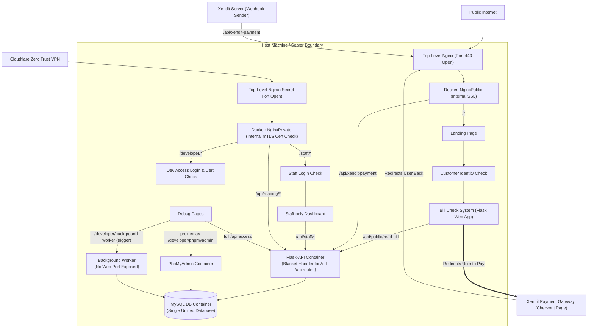

# Target Architecture

```mermaid
flowchart TD
    %% Define External Entry Points
    Internet[Public Internet]
    CF[Cloudflare Zero Trust VPN]

    subgraph Host Machine ["Host Machine / Server Boundary"]
        %% Top-Level Nginx Edge (Port Gatekeepers)
        Port443["Top-Level Nginx (Port 443 Open)"]
        PortSecret["Top-Level Nginx (Secret Port Open)"]

        %% Your Docker Container Network (Isolated Gateway Layer)
        NginxPublic["Docker: NginxPublic (Internal SSL)"]
        NginxPrivate["Docker: NginxPrivate (Internal mTLS Cert Check)"]

        %% Frontends & Internal Routing Services
        Landing["Landing Page"]
        CustCheck["Customer Identity Check"]
        BillCheck["Bill Check System (Flask Web App)"]
        
        StaffLogin["Staff Login Check"]
        StaffDash["Staff-only Dashboard"]
        
        DevCheck["Dev Access Login & Cert Check"]
        Debug["Debug Pages"]

        %% Unified Core Application Layer (Containers)
        API["Flask-API Container\n(Blanket Handler for ALL /api routes)"]
        Worker["Background Worker\n(No Web Port Exposed)"]
        PMA["PhpMyAdmin Container"]
        DB[("MySQL DB Container\n(Single Unified Database)")]
    end

    %% Third-Party Integrations (Outside Host)
    XenditGateway["Xendit Payment Gateway (Checkout Page)"]
    XenditWebhook["Xendit Server (Webhook Sender)"]

    %% --- Connections & Routes ---

    %% Public Traffic Entering via Port 443 Only
    Internet --> Port443
    XenditWebhook -->|"/api/xendit-payment"| Port443
    Port443 --> NginxPublic

    %% Private VPN Traffic Entering via Secret Port Only
    CF --> PortSecret
    PortSecret --> NginxPrivate

    %% Inside Docker: Public Traffic Flow (Customer Journey)
    NginxPublic -->|"/*"| Landing
    Landing --> CustCheck
    CustCheck --> BillCheck
    BillCheck -->|"/api/public/read-bill"| API
    
    %% Customer redirected to pay & returns
    BillCheck ===>|"Redirects User to Pay"| XenditGateway
    XenditGateway -->|"Redirects User Back"| Port443

    %% Inside Docker: Public Webhook Routing
    NginxPublic -->|"/api/xendit-payment"| API

    %% Inside Docker: Staff Routing
    NginxPrivate -->|"/staff/*"| StaffLogin
    StaffLogin --- StaffDash
    StaffDash -->|"/api/staff/*"| API

    %% Inside Docker: Meter Reading App Routing
    NginxPrivate -->|"/api/reading/*"| API

    %% Inside Docker: Developer / Debug Routing
    NginxPrivate -->|"/developer/*"| DevCheck
    DevCheck --- Debug
    Debug -->|"full /api access"| API
    Debug -->|"proxied as /developer/phpmyadmin"| PMA
    Debug -->|"/developer/background-worker (trigger)"| Worker

    %% Backend Isolated Database Layer
    API --> DB
    PMA --> DB
    Worker --> DB
```
