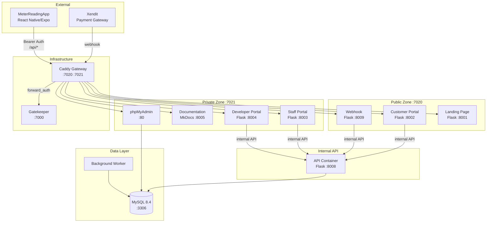
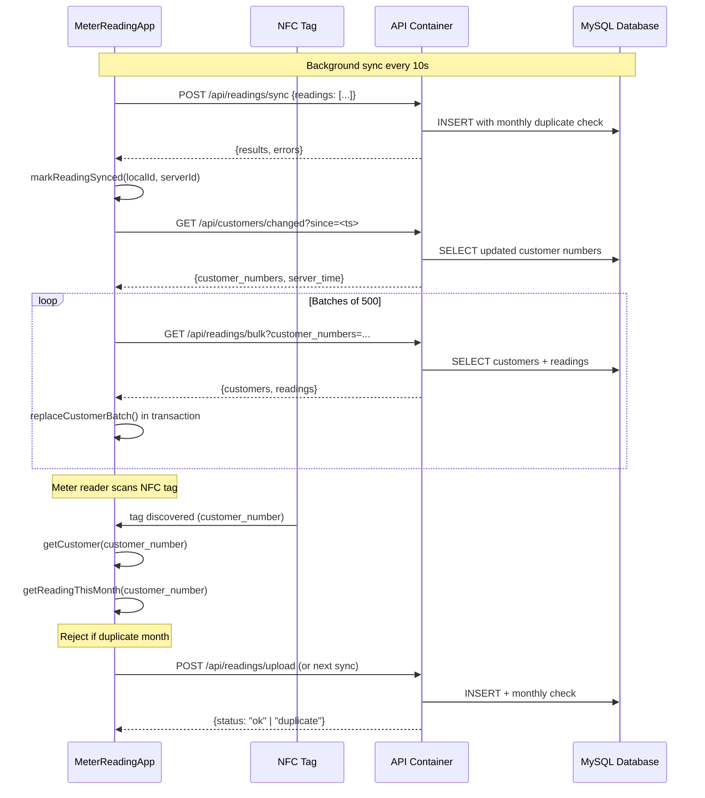
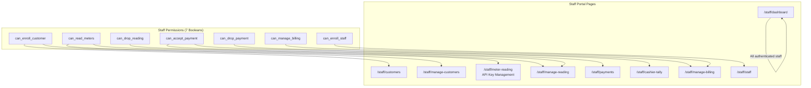
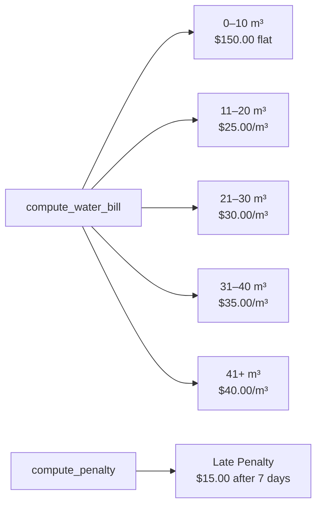

# System Architecture

## High-Level Container Diagram

---

## Network Topology

```mermaid
graph TB
    subgraph "net-public (bridge)"
        LAND[landing-page :8001]
        CP[customer-portal :8002]
        WH[webhook-container :8009]
        API[api :8008]
    end

    subgraph "net-private (bridge)"
        SP[staff-portal :8003]
        DP[developer-portal :8004]
        DOC[documentation :8005]
        PMA[phpMyAdmin :80]
    end

    subgraph "net-api (internal)"
        CP
        SP
        DP
        WH
        API
    end

    subgraph "net-data (internal)"
        DB[(mysql-db :3306)]
        WORKER[background-worker]
    end

    subgraph "net-gk (external)"
        GK[gatekeeper :7000]
    end

    subgraph "cloudflared-tunnel (external)"
        TUN[Cloudflare Tunnel]
    end

    CAD[caddy-gateway] --> net-public
    CAD --> net-private
    CAD --> net-gk
    CAD --> cloudflared-tunnel

    CP --> net-api
    SP --> net-api
    DP --> net-api
    WH --> net-api

    API --> net-data
    WORKER --> net-data
    PMA --> net-data

```

---

## Data Flow: Reading Sync

---

## Staff Permission Matrix

Seven boolean permissions control access to Staff Portal pages:

## Pricing Engine

Progressive tier calculation: consumption is applied to each tier bracket sequentially. For example, 35 m³ = $150 (first 10) + $250 (next 10 at $25) + $300 (next 10 at $30) + $175 (last 5 at $35) = **$875 total**.

---

## API Authentication Methods

| Method | Header / Parameter | Used By |
|---|---|---|---|
| **Bearer Token** | `Authorization: Bearer CRDC-<32hex>` | MeterReadingApp sync, mobile API calls |
| **Query Parameter** | `?api_key=CRDC-<32hex>` | Browser fallback for API key auth |
| **Internal API Key** | `X-Internal-API-Key` header | Container-to-container API calls |
| **Flask-Login Session** | Cookie-based | Staff portal pages |
| **Billing Cookie** | Signed cookie (receipt + name) | Customer billing portal `/billing/*` |
| **GateKeeper forward-auth** | `gatekeeper_token` cookie or `?access_code=` checked by the Caddy gate | All web surfaces (landing, portals, documentation, phpMyAdmin) |

---

## Background Worker

The background worker polls the database for pending tasks (using the `BackgroundTask` model):

- **Database backup** — scheduled MySQL dumps stored in the `db_backups` volume
- **Database restore** — restore from a previous backup
- **Database seed** — populate test data
- **Xendit payment reconciliation** — verify Xendit payment status and sync
