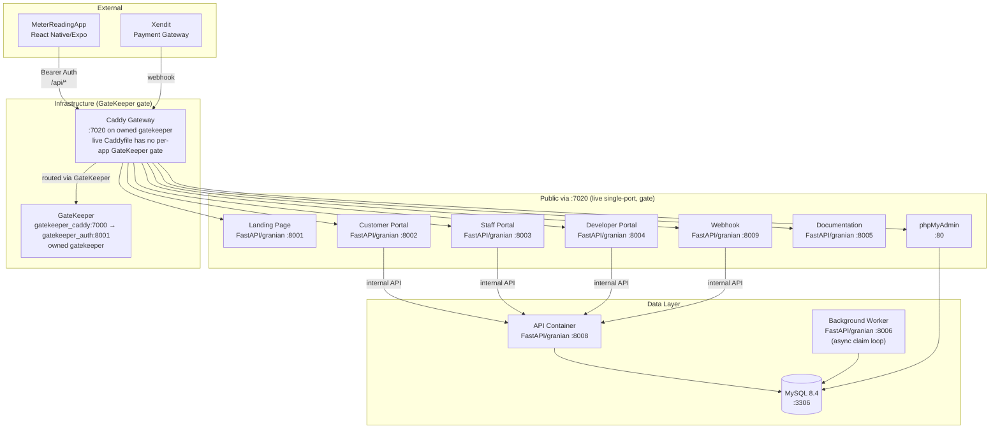
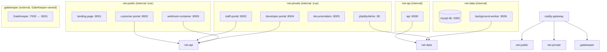
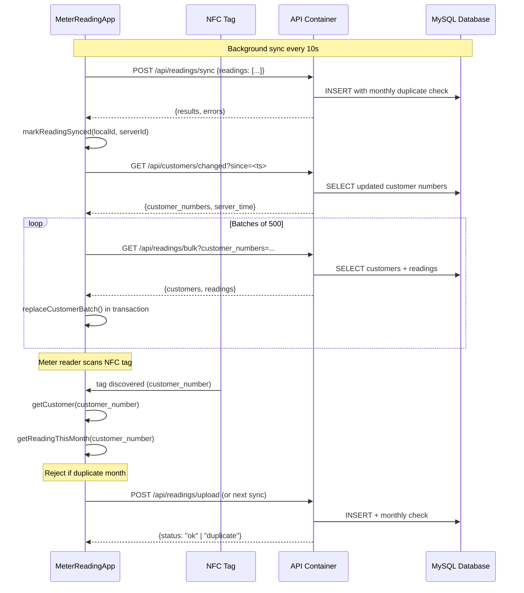
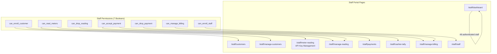
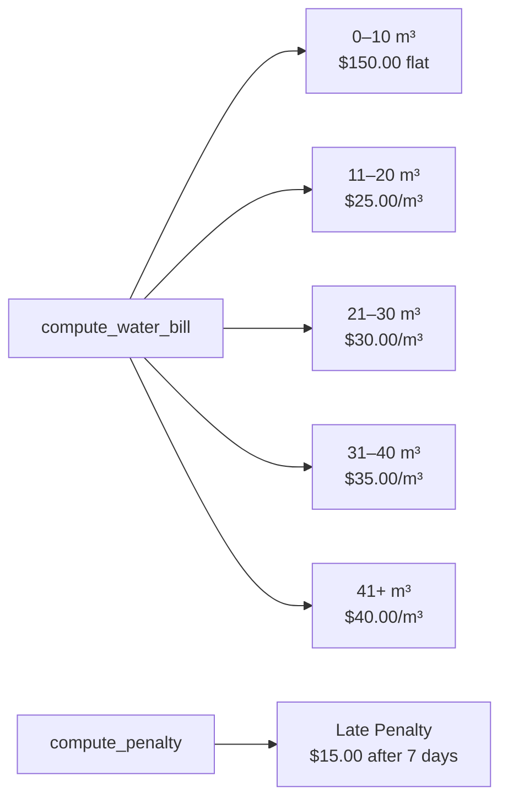
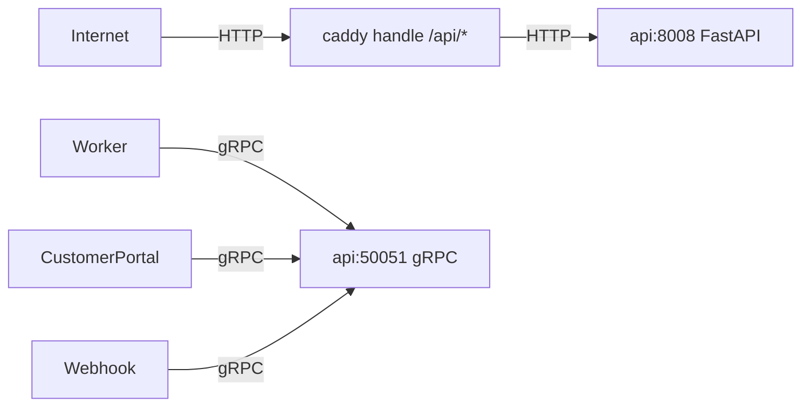

# System Architecture

**Stack**: FastAPI + granian. Every Python service — API, all portals, the webhook proxy, the documentation site, and the background worker — is a FastAPI app run by granian (ASGI, 1 worker each). There is no Flask and no Gunicorn; migration CLIs are gone.

## High-Level Container Diagram

---

## Network Topology

Five networks: two `internal: true` app tiers (`net-public`, `net-private`), two internal (`net-api`, `net-data`), one external (`gatekeeper`, GateKeeper-owned). Live Caddy joins `gatekeeper`; `caddy-gateway/Caddyfile` has 0 `GateKeeper gate` — the gate is in GateKeeper's routes plus rules.

---

## Runtime & Data Access

- **Async SQLAlchemy**: API, portals, webhook, and worker use `shared/db_async.py` — an async engine (`mysql+pymysql` from `DB_ENGINE` is swapped to `aiomysql`) with an `AsyncSession` per request via contextvar. Legacy sync shared services (payment, audit, seeding) run via `asyncio.to_thread` / `run_in_threadpool` with a separate sync session.
- **Strict env validation**: `shared/config.py` validates required env vars at import time and `sys.exit(1)`s with a `FATAL` list when anything is missing. `compose.yaml` uses `${VAR:?}` everywhere — `docker compose up` also refuses to start on missing vars. `REVERSE_PROXY_PREFIX` is the only variable allowed to be blank.
- **Password hashing**: pure stdlib (`shared/passwords.py`) — new hashes use a custom pbkdf2-hmac-sha512 scheme (100k iterations, 64-hex salt); legacy werkzeug `sha256$` / `pbkdf2:` / scrypt formats are still verifiable. No werkzeug dependency.

---

## Data Flow: Reading Sync

---

## Staff Permission Matrix

Seven boolean permissions control access to Staff Portal pages:

## Pricing Engine

Progressive tier calculation: consumption is applied to each tier bracket sequentially. For example, 35 m³ = $150 (first 10) + $250 (next 10 at $25) + $300 (next 10 at $30) + $175 (last 5 at $35) = **$875 total**.

---

## API Authentication Methods

| Method | Header / Parameter | Used By |
|---|---|---|
| **API Key (Bearer)** | `Authorization: Bearer CRDC-<32hex>` | MeterReadingApp sync, mobile API calls |
| **API Key (query)** | `?api_key=CRDC-<32hex>` | Browser fallback for API key auth |
| **Internal API Key** | `X-Internal-API-Key` + `X-Staff-ID` (re-derived staff, OR perm; `GET /api/debug/*` requires `can_enroll_staff`) | Container-to-container API calls |
| **JWT Session Cookie** | `PyJWT HS256 ISS=wbs AUD=waterbillingsystem` — `billing_session` 12h `Path /customer/` `HttpOnly SameSite=Lax Secure`, `session` 8h staff+dev (`shared/wbs_jwt.py`; `shared/auth.py` one-deploy fallback) | Staff portal, customer billing, developer portal |
| **Webhook Token** | `X-Callback-Token` value matching `XENDIT_WEBHOOK_TOKEN` or `INTERNAL_API_KEY` | Xendit webhook callback |
| **GateKeeper gate** | GateKeeper-owned `gatekeeper` (`gatekeeper_caddy:7000 → gatekeeper_auth:8001` verifies via DB routes, then proxies); Caddy `:7020` has 0 per-app `GateKeeper gate` | All web surfaces via single-port `:7020` |

---

## Internal gRPC vs Public HTTP

Public traffic enters via Caddy (`handle /api/* -> api:8008`), internal traffic prefers gRPC (`api:50051`).

| Traffic | Protocol | Endpoint | Channel / Proxy | Auth |
|---|---|---|---|---|
| `api:50051` internal (worker → api, customer-portal → api, webhook → api) | gRPC | `grpc.aio.server` on `api:50051` | `grpc.aio.insecure_channel("api:50051")` | `x-internal-api-key` metadata |
| Browser / webhook / public `caddy` → `api` | HTTP | FastAPI `APIRouter(prefix="/api")` on `api:8008` | `caddy` `handle /api/*` + `reverse_proxy api:8008` | GateKeeper gate, cookie/session, or `Authorization: Bearer` |

Proto definitions live in `shared/proto/billing.proto` (`package api.v1; service BillingService`). Generated stubs are in `shared/proto_gen/` via `grpc_tools.protoc`. The gRPC server runs alongside FastAPI in the same `api` container (lifespan `start_grpc_server()` on `0.0.0.0:50051`); portals and webhook dial `API_GRPC_ADDR=api:50051` with `x-internal-api-key` metadata and fall back to HTTP `API_INTERNAL_URL=http://api:8008` when gRPC is unavailable. Port `50051` is `expose:` only on the internal `net-api` network, never `ports:`-published or proxied through Caddy.

- Generate stubs: `uv run --python 3.14 --with grpcio-tools -- python -m grpc_tools.protoc -I shared/proto --python_out=shared/proto_gen --grpc_python_out=shared/proto_gen shared/proto/billing.proto`
- Client: `async with grpc.aio.insecure_channel("api:50051") as ch: stub = BillingServiceStub(ch); await stub.GetCustomer(..., metadata=(("x-internal-api-key", key),))`
- Server: `server = grpc.aio.server(); add_BillingServiceServicer_to_server(BillingServicer(), server); server.add_insecure_port("0.0.0.0:50051")`

---

## Startup Preflight & Self-Healing

On every boot, the API container (`api/preflight.py`) compares the live schema against the SQLAlchemy models before serving traffic:

- **Auto-fixes** (safe — cannot invalidate existing data): missing tables (`create_all`), missing indexes (a 14-entry audit manifest plus model-derived indexes), widening column drift (`ALTER MODIFY` preserving the `DEFAULT`), loosening `NOT NULL` → `NULL`, and dropping redundant (non-unique left-prefix) indexes.
- **Fatal** (crash-loop with `sys.exit(1)` and printed findings + suggested `ALTER`/`DROP` commands): missing columns, incompatible type changes, time-named columns that aren't `DATETIME`, and index name/definition conflicts.
- Logs `preflight: OK` and only then runs the seeders (payment methods, prerequisite staff, phpMyAdmin guest DB account).

---

## Background Worker

The background worker is a **FastAPI app run by granian `--workers 1`** — exactly one process, one async claim loop. It polls the `background_tasks` table (the `BackgroundTask` model) and processes **one job at a time**:

- **Claim**: `SELECT ... FOR UPDATE SKIP LOCKED LIMIT 1` for the oldest queued task (`scheduled_at <= now`); stale tasks stuck `running` for more than 5 minutes are marked `failed`.
- **In-job concurrency**: month-batch handlers and Xendit reconciliation bound their internal fan-out with an `asyncio.Semaphore(WORKER_JOB_CONCURRENCY)` (default **8**).
- **Subprocesses**: `mysqldump` / `mysql` run via `asyncio.create_subprocess_exec`.
- **Xendit**: checked over `httpx` (async); sync shared services are called via `asyncio.to_thread` with a sync session.
- **Health**: `GET /health` on port 8006 reports `idle`/`working`, the current task type, and progress.

Task types: `backup`, `restore`, `clear`, `seed`, `read-this-month`, `unread-this-month`, `pay-this-month`, `remove-payment-this-month`, and `xendit_reconcile` (auto-enqueued every 5 minutes via `enqueue_unique`).
