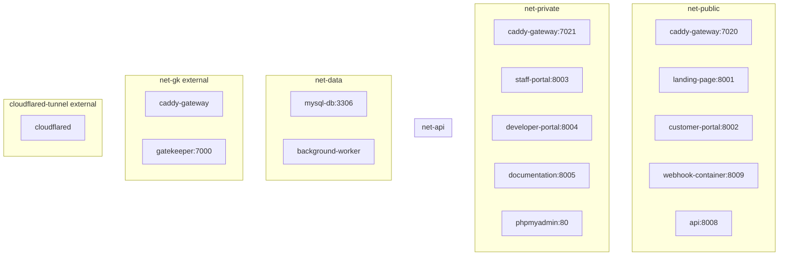

# Deployment

## Compose Architecture

The system runs as 11+ Docker services defined in `compose.yaml` at the project root.

### Services

| Service | Container | Host Port | Internal Port | Network | Purpose |
|---------|-----------|-----------|---------------|---------|---------|
| `caddy-gateway` | waterbillingsystem_gateway | 7020, 7021 | 7020, 7021 | net-public, net-private, cloudflared-tunnel | Reverse proxy + routing |
| `landing-page` | waterbillingsystem_landing | — | 8001 | net-public, net-gk | Public marketing page |
| `customer-portal` | waterbillingsystem_customerportal | — | 8002 | net-public, net-api, net-gk | Customer bill lookup |
| `staff-portal` | waterbillingsystem_staffportal | — | 8003 | net-private, net-api, net-gk | Staff dashboard |
| `developer-portal` | waterbillingsystem_devportal | — | 8004 | net-private, net-api, net-gk | API documentation |
| `webhook-container` | waterbillingsystem_webhook | — | 8009 | net-public, net-api | Xendit callback proxy |
| `api` | waterbillingsystem_api | — | 8008 | net-api, net-data, net-public | REST API |
| `background-worker` | waterbillingsystem_worker | — | — | net-data | Task processor |
| `phpmyadmin` | waterbillingsystem_phpmyadmin | — | 80 | net-private, net-data | DB admin UI |
| `documentation` | waterbillingsystem_documentation | — | 8005 | net-private, net-gk | MkDocs site |
| `mysql-db` | waterbillingsystem_db | — | 3306 | net-data | MySQL 8.4 |

### Caddy Gateway Routing

**Public port 7020** (external-facing):
| Path | Target |
|------|--------|
| `/webhook/*` | `webhook-container:8009` |
| `/customer/*` | `customer-portal:8002` |
| `/` (catch-all) | `landing-page:8001` |

**Private port 7021** (internal/admin):
| Path | Target |
|------|--------|
| `/staff/*` | `staff-portal:8003` |
| `/developer/*` | `developer-portal:8004` |
| `/documentation/*` | `documentation:8005` |
| `/phpmyadmin/*` | `phpmyadmin:80` |

### Network Topology



### Environment Variables Per Service

| Service | Required Env Vars |
|---------|------------------|
| `caddy-gateway` | `DEPLOYMENT_TYPE` |
| `landing-page` | `SECRET_KEY`, `DEPLOYMENT_TYPE` |
| `customer-portal` | `SECRET_KEY`, `INTERNAL_API_KEY`, `API_BASE_URL`, `DEPLOYMENT_TYPE`, `DEBUG` |
| `staff-portal` | `SECRET_KEY`, `INTERNAL_API_KEY`, `API_BASE_URL`, `CACHE_TYPE`, `DEPLOYMENT_TYPE` |
| `developer-portal` | `SECRET_KEY`, `INTERNAL_API_KEY`, `API_BASE_URL`, `DEPLOYMENT_TYPE` |
| `webhook-container` | `SECRET_KEY`, `INTERNAL_API_KEY`, `API_BASE_URL`, `DEPLOYMENT_TYPE` |
| `api` | `DB_*`, `SECRET_KEY`, `INTERNAL_API_KEY`, `NFC_PWD_SECRET`, `XENDIT_*`, `CACHE_TYPE`, `PYTHON_GIL`, `DEPLOYMENT_TYPE` |
| `background-worker` | `DB_*`, `XENDIT_API_KEY`, `DEPLOYMENT_TYPE` |
| `phpmyadmin` | `PMA_HOST`, `PMA_PORT` |
| `documentation` | `SECRET_KEY`, `DEPLOYMENT_TYPE` |
| `mysql-db` | `DB_PASS` (as `MYSQL_ROOT_PASSWORD`), `DB_NAME` (as `MYSQL_DATABASE`) |

## Database

MySQL 8.4 with healthcheck (`mysqladmin ping`, 5s interval). Named volume `mysql_data` for persistence.

The `api` container runs `db.create_all()` and Alembic migrations on startup. The `background-worker` also needs DB access for task polling.

### Backup/Restore

Backups are `.sql` files stored in the `db_backups` Docker volume mounted at `/app/db_backups` in the API and worker containers. Accessible via debug panel endpoints:
- `POST /api/debug/backup` — queue a `mysqldump`-based backup
- `GET /api/debug/backups` — list available backups
- `POST /api/debug/restore` — queue a restore from a specific file
- `GET /api/debug/restore-newest` — restore from newest backup

All backup/restore operations run via the background task queue.

## External Networks

| Network | Type | Purpose |
|---------|------|---------|
| `cloudflared-tunnel` | external (`cloudflared-tunnel_default`) | Cloudflare tunnel for public access |
| `net-gk` | external (`gatekeeper_default`) | GateKeeper forward-auth service (caddy-gateway only) |

## Deployment Commands

```bash
# Start all services
docker compose up -d

# Rebuild specific service
docker compose up -d --build api

# View all logs
docker compose logs -f

# View logs for specific service
docker compose logs -f api

# Stop all services
docker compose down

# Stop + remove volumes (destructive)
docker compose down -v
```
