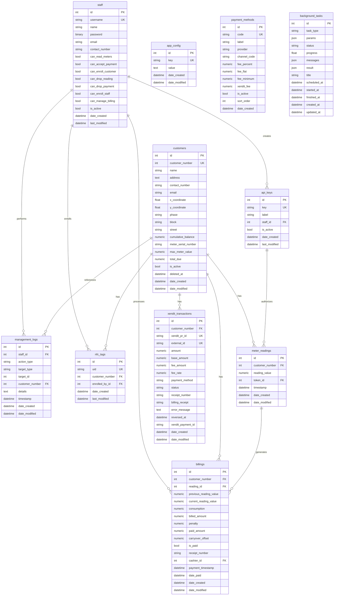

# Database Models

11 models defined in `shared/models.py`. All tables use SQLAlchemy ORM with MySQL 8.4.

## Entity Relationship Diagram

## Model Details

### Staff (`staff`)

| Column | Type | Constraints |
|--------|------|-------------|
| `id` | Integer | PK |
| `username` | String(64) | UNIQUE, NOT NULL |
| `name` | String(128) | NOT NULL, default "" |
| `password` | LargeBinary | NOT NULL (PBKDF2 hash) |
| `email` | String(128) | nullable |
| `contact_number` | String(32) | nullable |
| `can_read_meters` | Boolean | default False |
| `can_accept_payment` | Boolean | default False |
| `can_enroll_customer` | Boolean | default False |
| `can_drop_reading` | Boolean | default False |
| `can_drop_payment` | Boolean | default False |
| `can_enroll_staff` | Boolean | default False |
| `can_manage_billing` | Boolean | default False |
| `is_active` | Boolean | default True |
| `date_created` | DateTime | default utcnow |
| `last_modified` | DateTime | default utcnow, onupdate utcnow |

Plain SQLAlchemy `Base` model (no mixins). Relationships: `api_keys`, `billings`, `management_logs`, `nfc_tags`.

### Customer (`customers`)

| Column | Type | Constraints |
|--------|------|-------------|
| `id` | Integer | PK |
| `customer_number` | Integer | UNIQUE, NOT NULL, INDEX |
| `name` | String(128) | nullable |
| `address` | Text | nullable |
| `contact_number` | String(32) | nullable |
| `email` | String(128) | nullable |
| `x_coordinate` | Float | nullable (latitude) |
| `y_coordinate` | Float | nullable (longitude) |
| `phase` | String(64) | nullable |
| `block` | String(64) | nullable |
| `street` | String(128) | nullable |
| `cumulative_balance` | Numeric(10,2) | default 0.00 |
| `total_due` | Numeric(10,2) | default 0.00, auto-recalculated on payment/reading changes |
| `meter_serial_number` | String(64) | nullable, INDEX |
| `max_meter_value` | Numeric(10,2) | default 99999.00 |
| `is_active` | Boolean | default True |
| `deleted_at` | DateTime | nullable |
| `date_created` | DateTime | default utcnow |
| `date_modified` | DateTime | default utcnow, onupdate utcnow |

Relationships: `meter_readings`, `billings`, `nfc_tags`, `xendit_transactions`.

### MeterReading (`meter_readings`)

| Column | Type | Constraints |
|--------|------|-------------|
| `id` | Integer | PK |
| `customer_number` | Integer | FK → customers.customer_number, NOT NULL, INDEX |
| `reading_value` | Numeric(10,2) | NOT NULL |
| `token_id` | Integer | FK → api_keys.id, NOT NULL, INDEX |
| `timestamp` | DateTime | NOT NULL, INDEX |
| `date_created` | DateTime | default utcnow |
| `date_modified` | DateTime | default utcnow, onupdate utcnow |

Relationships: `customer` → Customer, `token` → ApiKey, `billings` → Billing (backref).

### Billing (`billings`)

| Column | Type | Constraints |
|--------|------|-------------|
| `id` | Integer | PK |
| `customer_number` | Integer | FK → customers.customer_number, NOT NULL, INDEX |
| `reading_id` | Integer | FK → meter_readings.id, nullable |
| `previous_reading_value` | Numeric(10,2) | nullable |
| `current_reading_value` | Numeric(10,2) | nullable |
| `consumption` | Numeric(10,2) | nullable |
| `billed_amount` | Numeric(10,2) | NOT NULL, default 0 |
| `penalty` | Numeric(10,2) | NOT NULL, default 0 |
| `paid_amount` | Numeric(10,2) | NOT NULL, default 0 |
| `carryover_offset` | Numeric(10,2) | NOT NULL, default 0 |
| `is_paid` | Boolean | NOT NULL, default False |
| `receipt_number` | String(64) | nullable |
| `cashier_id` | Integer | FK → staff.id, nullable, INDEX |
| `payment_timestamp` | DateTime | nullable |
| `date_paid` | DateTime | nullable |
| `date_created` | DateTime | default utcnow |
| `date_modified` | DateTime | default utcnow, onupdate utcnow |

Relationships: `customer` → Customer, `reading` → MeterReading, `cashier` → Staff.

### ApiKey (`api_keys`)

| Column | Type | Constraints |
|--------|------|-------------|
| `id` | Integer | PK |
| `key` | String(128) | UNIQUE, NOT NULL |
| `label` | String(128) | nullable |
| `staff_id` | Integer | FK → staff.id, NOT NULL |
| `is_active` | Boolean | default True |
| `date_created` | DateTime | default utcnow |
| `last_modified` | DateTime | default utcnow, onupdate utcnow |

Relationships: `staff` → Staff, `meter_readings` → MeterReading.

### NfcTag (`nfc_tags`)

| Column | Type | Constraints |
|--------|------|-------------|
| `id` | Integer | PK |
| `uid` | String(64) | UNIQUE, NOT NULL |
| `customer_number` | Integer | FK → customers.customer_number, NOT NULL, INDEX |
| `enrolled_by_id` | Integer | FK → staff.id, NOT NULL |
| `date_created` | DateTime | default utcnow |
| `last_modified` | DateTime | default utcnow, onupdate utcnow |

Relationships: `customer` → Customer, `enrolled_by` → Staff.

### ManagementLog (`management_logs`)

| Column | Type | Constraints |
|--------|------|-------------|
| `id` | Integer | PK |
| `staff_id` | Integer | FK → staff.id, NOT NULL |
| `action_type` | String(64) | NOT NULL |
| `target_type` | String(64) | NOT NULL |
| `target_id` | Integer | NOT NULL |
| `customer_number` | String(64) | FK → customers.customer_number, nullable, INDEX |
| `details` | Text | nullable |
| `timestamp` | DateTime | NOT NULL, INDEX |
| `date_created` | DateTime | default utcnow |
| `date_modified` | DateTime | default utcnow, onupdate utcnow |

Relationship: `staff` → Staff.

ActionType enum values: `duplicate`, `drop_payment`, `edit_payment`, `drop_reading`, `edit_reading`.

### Config (`app_config`)

| Column | Type | Constraints |
|--------|------|-------------|
| `id` | Integer | PK |
| `key` | String(128) | UNIQUE, NOT NULL |
| `value` | Text | nullable |
| `date_created` | DateTime | default utcnow |
| `date_modified` | DateTime | default utcnow, onupdate utcnow |

Key-value store. Used for `nfc_generation` counter.

### PaymentMethod (`payment_methods`)

| Column | Type | Constraints |
|--------|------|-------------|
| `id` | Integer | PK |
| `code` | String(64) | UNIQUE, NOT NULL, INDEX |
| `label` | String(128) | NOT NULL |
| `provider` | String(32) | nullable |
| `channel_code` | String(64) | nullable |
| `fee_percent` | Numeric(5,2) | nullable |
| `fee_flat` | Numeric(10,2) | nullable |
| `fee_minimum` | Numeric(10,2) | nullable |
| `xendit_fee` | Numeric(10,2) | nullable |
| `is_active` | Boolean | NOT NULL, default True |
| `sort_order` | Integer | NOT NULL, default 0 |
| `date_created` | DateTime | default utcnow |

Method: `fee_for(amount) -> float` computes total fee. Seeded by `fee_service.seed_payment_methods()`.

### XenditTransaction (`xendit_transactions`)

| Column | Type | Constraints |
|--------|------|-------------|
| `id` | Integer | PK |
| `customer_number` | Integer | FK → customers.customer_number, NOT NULL, INDEX |
| `xendit_pr_id` | String(128) | UNIQUE, NOT NULL, INDEX |
| `external_id` | String(256) | UNIQUE, NOT NULL |
| `amount` | Numeric(10,2) | NOT NULL |
| `base_amount` | Numeric(10,2) | nullable |
| `fee_amount` | Numeric(10,2) | nullable |
| `fee_rate` | Numeric(5,2) | nullable |
| `payment_method` | String(32) | NOT NULL |
| `status` | String(32) | NOT NULL, default "PENDING" |
| `receipt_number` | String(64) | nullable |
| `billing_receipt` | String(64) | nullable |
| `error_message` | Text | nullable |
| `reversed_at` | DateTime | nullable |
| `xendit_payment_id` | String(128) | nullable |
| `date_created` | DateTime | default utcnow |
| `date_modified` | DateTime | default utcnow, onupdate utcnow |

Relationship: `customer` → Customer.

### BackgroundTask (`background_tasks`)

| Column | Type | Constraints |
|--------|------|-------------|
| `id` | Integer | PK |
| `task_type` | String(64) | NOT NULL, INDEX |
| `params` | JSON | nullable |
| `status` | String(16) | NOT NULL, default "queued", INDEX |
| `progress` | Float | NOT NULL, default 0.0 |
| `messages` | JSON | NOT NULL, default [] |
| `result` | JSON | nullable |
| `title` | String(256) | nullable |
| `scheduled_at` | DateTime | nullable |
| `started_at` | DateTime | nullable |
| `finished_at` | DateTime | nullable |
| `created_at` | DateTime | NOT NULL, default utcnow |
| `updated_at` | DateTime | NOT NULL, default utcnow, onupdate utcnow |

Class methods: `enqueue(task_type, params, title, scheduled_at)` and `enqueue_unique(task_type, ...)` (prevents duplicate queued/running tasks).
