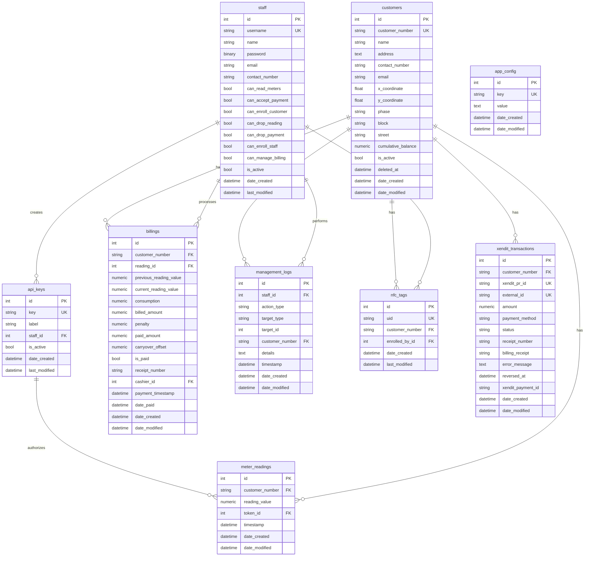

# Database Models

All models are defined in `apps/models.py`. BillServer uses 9 tables managed by SQLAlchemy (`customers`, `staff`, `meter_readings`, `billings`, `api_keys`, `management_logs`, `nfc_tags`, `app_config`, `xendit_transactions`).

## Entity Relationship Diagram

---

## Model Details

### Staff

| Column | Type | Constraints |
|---|---|---|
| `id` | Integer | PK |
| `username` | String(64) | UNIQUE, NOT NULL |
| `name` | String(128) | NOT NULL, default "" |
| `password` | LargeBinary | NOT NULL (Werkzeug PBKDF2 hash) |
| `email` | String(128) | nullable |
| `contact_number` | String(32) | nullable |
| `can_read_meters` | Boolean | default False |
| `can_accept_payment` | Boolean | default False |
| `can_enroll_customer` | Boolean | default False |
| `can_drop_reading` | Boolean | default False |
| `can_drop_payment` | Boolean | default False |
| `can_enroll_staff` | Boolean | default False |
| `can_manage_billing` | Boolean | default False |
| `is_active` | Boolean | default True |
| `date_created` | DateTime | default utcnow |
| `last_modified` | DateTime | default utcnow, onupdate utcnow |

Inherits `UserMixin` from Flask-Login.

### Customer

| Column | Type | Constraints |
|---|---|---|
| `id` | Integer | PK |
| `customer_number` | String(64) | UNIQUE, NOT NULL, INDEX |
| `name` | String(128) | nullable |
| `address` | Text | nullable |
| `contact_number` | String(32) | nullable |
| `email` | String(128) | nullable |
| `x_coordinate` | Float | nullable (latitude) |
| `y_coordinate` | Float | nullable (longitude) |
| `phase` | String(64) | nullable |
| `block` | String(64) | nullable |
| `street` | String(128) | nullable |
| `cumulative_balance` | Numeric(10,2) | default 0.00 |
| `is_active` | Boolean | default True |
| `deleted_at` | DateTime | nullable |
| `date_created` | DateTime | default utcnow |
| `date_modified` | DateTime | default utcnow, onupdate utcnow |

Relationships: `meter_readings` (backref), `billings` (backref), `nfc_tags` (backref)

### MeterReading

| Column | Type | Constraints |
|---|---|---|
| `id` | Integer | PK |
| `customer_number` | String(64) | FK → customers.customer_number, NOT NULL, INDEX |
| `reading_value` | Numeric(10,2) | NOT NULL |
| `token_id` | Integer | FK → api_keys.id, NOT NULL, INDEX |
| `timestamp` | DateTime | NOT NULL, INDEX |
| `date_created` | DateTime | default utcnow |
| `date_modified` | DateTime | default utcnow, onupdate utcnow |

Relationships: `customer` → Customer, `token` → ApiKey, `billings` → Billing

### Billing

| Column | Type | Constraints |
|---|---|---|
| `id` | Integer | PK |
| `customer_number` | String(64) | FK → customers.customer_number, NOT NULL, INDEX |
| `reading_id` | Integer | FK → meter_readings.id, nullable |
| `previous_reading_value` | Numeric(10,2) | nullable |
| `current_reading_value` | Numeric(10,2) | nullable |
| `consumption` | Numeric(10,2) | nullable |
| `billed_amount` | Numeric(10,2) | NOT NULL, default 0 |
| `penalty` | Numeric(10,2) | NOT NULL, default 0 |
| `paid_amount` | Numeric(10,2) | NOT NULL, default 0 |
| `carryover_offset` | Numeric(10,2) | NOT NULL, default 0 |
| `is_paid` | Boolean | NOT NULL, default False |
| `receipt_number` | String(64) | nullable |
| `cashier_id` | Integer | FK → staff.id, nullable, INDEX |
| `payment_timestamp` | DateTime | nullable |
| `date_paid` | DateTime | nullable |
| `date_created` | DateTime | default utcnow |
| `date_modified` | DateTime | default utcnow, onupdate utcnow |

Relationships: `customer` → Customer, `reading` → MeterReading, `cashier` → Staff

### ApiKey

| Column | Type | Constraints |
|---|---|---|
| `id` | Integer | PK |
| `key` | String(128) | UNIQUE, NOT NULL |
| `label` | String(128) | nullable |
| `staff_id` | Integer | FK → staff.id, NOT NULL |
| `is_active` | Boolean | default True |
| `date_created` | DateTime | default utcnow |
| `last_modified` | DateTime | default utcnow, onupdate utcnow |

Relationships: `staff` → Staff, `meter_readings` → MeterReading

### ManagementLog

| Column | Type | Constraints |
|---|---|---|
| `id` | Integer | PK |
| `staff_id` | Integer | FK → staff.id, NOT NULL |
| `action_type` | String(64) | NOT NULL (enum value) |
| `target_type` | String(64) | NOT NULL |
| `target_id` | Integer | NOT NULL |
| `customer_number` | String(64) | FK → customers.customer_number, nullable, INDEX |
| `details` | Text | nullable |
| `timestamp` | DateTime | NOT NULL, INDEX |
| `date_created` | DateTime | default utcnow |
| `date_modified` | DateTime | default utcnow, onupdate utcnow |

### NfcTag

| Column | Type | Constraints |
|---|---|---|
| `id` | Integer | PK |
| `uid` | String(64) | UNIQUE, NOT NULL |
| `customer_number` | String(64) | FK → customers.customer_number, NOT NULL, INDEX |
| `enrolled_by_id` | Integer | FK → staff.id, NOT NULL |
| `date_created` | DateTime | default utcnow |
| `last_modified` | DateTime | default utcnow, onupdate utcnow |

Relationships: `customer` → Customer, `enrolled_by` → Staff

### Config

| Column | Type | Constraints |
|---|---|---|
| `id` | Integer | PK |
| `key` | String(128) | UNIQUE, NOT NULL |
| `value` | Text | nullable |
| `date_created` | DateTime | default utcnow |
| `date_modified` | DateTime | default utcnow, onupdate utcnow |

### XenditTransaction

| Column | Type | Constraints |
|---|---|---|
| `id` | Integer | PK |
| `customer_number` | String(64) | FK → customers.customer_number, NOT NULL, INDEX |
| `xendit_pr_id` | String(128) | UNIQUE, NOT NULL, INDEX |
| `external_id` | String(256) | UNIQUE, NOT NULL |
| `amount` | Numeric(10,2) | NOT NULL |
| `payment_method` | String(32) | NOT NULL |
| `status` | String(32) | NOT NULL, default "PENDING" |
| `receipt_number` | String(64) | nullable |
| `billing_receipt` | String(64) | nullable |
| `error_message` | Text | nullable |
| `reversed_at` | DateTime | nullable |
| `xendit_payment_id` | String(128) | nullable |
| `date_created` | DateTime | default utcnow |
| `date_modified` | DateTime | default utcnow, onupdate utcnow |

Relationship: `customer` → Customer (xendit_transactions.customer_number → customers.customer_number)

### ActionType Enum

| Value | Description |
|---|---|
| `duplicate` | Duplicate reading detected |
| `drop_payment` | Payment deleted |
| `edit_payment` | Payment amount changed |
| `drop_reading` | Reading deleted |
| `edit_reading` | Reading value changed |
