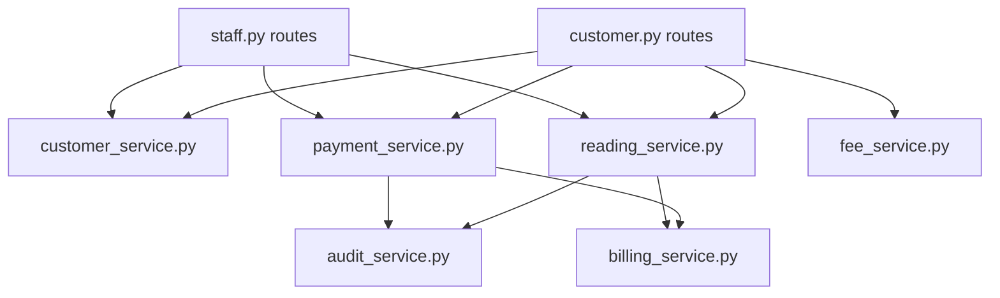

# Services Layer

Business logic is split between API-local services (`api/`) and shared services (`shared/services/`). All are plain Python modules exporting standalone functions. Routes are async FastAPI handlers; sync shared services are called via `asyncio.to_thread` / `run_in_threadpool` with a dedicated sync session.

## API Services

### reading_service.py (`api/reading_service.py`)

Reading sync, upload, CRUD, auto billing creation. Sync functions take a `session` keyword for unit testing.

**`_existing_this_month(customer_number, timestamp_dt, exclude_id=None)`** → `MeterReading | None`
Checks if a reading exists for the same customer/year/month.

**`sync_readings(readings, token_id, staff_id, staff_name)`** → `(synced, results, errors)`
Processes a batch from mobile app sync. Each reading validated for customer existence, timestamp format, and monthly duplicate.

| Param | Type | Description |
|-------|------|-------------|
| `readings` | list[dict] | `[{customer_number, reading_value, timestamp?}]` |
| `token_id` | int | API key ID (FK) |
| `staff_id` | int | Staff ID |
| `staff_name` | str | For audit log |

Returns `[{index, reading_id, customer_number, billing?}]` on success.

**`upload_reading(customer_number, reading_value, timestamp, token_id, staff_id, staff_name)`** → `(reading, error, status)`
Same validation as sync. Auto-creates billing via `_create_billing_for_reading()`.

**`drop_reading(reading_id, staff_id, reason)`** → `MeterReading`
Hard-deletes a reading and its billing record. Validates: must be current month, bill must be unpaid.

**`edit_reading(reading_id, new_value, staff_id)`** → `MeterReading`
Updates reading value and recomputes billing consumption/amount.

### customer_service.py (`api/customer_service.py`)

Customer CRUD and due amount computation. Functions accept a `session` keyword (sync session when called from threads).

**`create_customer(data, *, session=None)`** → `(Customer, error)`
Validates customer_number uniqueness, creates record.

**`update_customer(customer, data)`** → `None`
Partial update of customer fields.

**`toggle_active(customer)`** → `None`
Soft-delete (sets `deleted_at`) or restore.

**`list_customers(page, per_page, q, sort_by, sort_dir)`** → `Pagination`
Paginated, searchable, sortable customer listing.

**`compute_customer_due(customer)`** → `float`
Sum of unpaid bills + penalties minus carryover credit.

**`compute_batch_due(customers)`** → `dict[str, float]`
Batch due computation using single query for all customers.

**`get_customer_by_number(customer_number)`** → `Customer | None`

**`recalc_total_due(customer_number)`** → `float`, recomputes and persists the `total_due` column (called on customer profile access and payment changes).

### fee_service.py (`api/fee_service.py`)

Payment method fee calculations. Async (uses the async session).

**`calculate_fee(amount, method_code)`** → `(fee_percent, fee_amount)`
Looks up active payment method, computes fee using `PaymentMethod.fee_for()`.

**`get_method(code)`** → `PaymentMethod | None`

**`seed_payment_methods()`** → `None`
Seeds 22 payment methods: GCash, Maya, GrabPay, ShopeePay, cards (domestic/international), direct debit (BPI, UBP, RCBC), online banking, OTC (7-Eleven, Cebuana, ECPay, LBC, M Lhuillier, Palawan, Robinsons, SM, USSC), QRPh, BillEase, virtual account.

### billing_service.py (`api/billing_service.py`)

**`ensure_penalty(billing)`** → `float` (async)
Checks if an unpaid bill is past its due date (7 days after reading). If overdue and no penalty yet applied, writes ₱15.00 penalty to DB.

The due date is derived from `billing.reading.timestamp`, falling back to
`date_created` when a bill has no reading. That relationship is `lazy="selectin"`
(`shared/models.py`), so it loads with every `Billing` query rather than on first
access: an async session cannot perform lazy I/O outside the greenlet, and the
resulting `MissingGreenlet` surfaced as a `502` on the customer portal History tab.
Any new query whose rows reach `.reading` is already covered by the relationship
strategy; an explicit `selectinload(Billing.reading)` is redundant but harmless.

## Shared Services

### payment_service.py (`shared/services/payment_service.py`)

Waterfall payment processing. All functions take a `session` keyword and are sync (called from routes/worker via threads).

**`submit_payment(customer_number, amount, cashier_id, *, session)`** → `(result, error, status)`
Applies payment to oldest unpaid bills first. Excess cash creates carryover credit on the most recently paid bill. Insufficient payment leaves remainder unpaid.

**`drop_payment(payment_id, staff_id, reason)`** → `dict`
Undoes a receipt group (all bills sharing the same receipt number). Reverts `is_paid`, clears `paid_amount`, `receipt_number`, `cashier_id`, `payment_timestamp`, `date_paid`, `carryover_offset`.

**`recalc_cumulative_balance(customer_number, *, customer=None)`** → `None`
Recalculates and updates `customer.cumulative_balance` from all `carryover_offset` sums.

**`parse_date_range(period, start_str, end_str, ref_date)`** → `(start, end)`
Converts period type + date strings to datetime bounds. Supports: daily, weekly, monthly, yearly, custom.

**`compute_cashier_tally(start, end, staff_id, group_days)`** → `(tally, use_matrix)`
Aggregates payments within date range, optionally grouped by interval. Returns matrix format when `group_days > 1`.

**`compute_nav_dates(period, start, end, today)`** → `dict`
Returns `prev_date`, `next_date`, `display`, `is_today`.

### audit_service.py (`shared/services/audit_service.py`)

**`log_action(staff_id, action_type, target_type, target_id, details, customer_number=None)`** → `ManagementLog`
Creates an audit log entry. Called automatically on destructive operations by reading_service and payment_service.

### staff_seeder.py (`shared/services/staff_seeder.py`)

**`ensure_prereq_staff()`** → `None`
Seeds superuser (all permissions, password: `superuser`) and xendit system user (`can_accept_payment`, `can_manage_billing`, `can_drop_payment`) on first startup.

**`delete_non_prereq_staff()`** → `None`
Removes all staff except superuser and xendit (used during seed/clear).

### guest_seeder.py (`shared/services/guest_seeder.py`)

**`ensure_guest_user()`** → `None`
Creates the phpMyAdmin guest MySQL account (`GUEST_DB_PASSWORD`, restricted to `DB_NAME`) on API startup. The API container connects to MySQL as root via `DB_PASS` to provision it.

## Background Worker (`worker/`)

A FastAPI app run by granian `--workers 1` (one process, one async claim loop).

- **`background_worker.py`**: claim loop, `TaskState` progress tracking, `/health` endpoint.
- **`task_handlers.py`**: per-task-type handlers, `HANDLERS` registry.

### Claim Loop

1. **Enqueue**: routes call `BackgroundTask.enqueue(task_type, params, title, scheduled_at)` (or `enqueue_unique` for the periodic Xendit reconcile).
2. **Claim**: `SELECT ... WHERE status='queued' AND (scheduled_at IS NULL OR scheduled_at <= NOW) ORDER BY created_at ASC ... FOR UPDATE SKIP LOCKED LIMIT 1`, **exactly one job at a time**. Stale tasks stuck `running` for >5 minutes are marked `failed` first.
3. **Execute**: sets `running` + `started_at`, awaits the handler with a `_report(pct, msg)` callback.
4. **Complete**: sets `completed`/`failed`, progress 100, stores final messages; progress is persisted to the DB every 0.5s by a background persister task.
5. **Health**: `GET /health` → `{status, mode: idle|working, current_task, progress, last_message}`.

### In-Job Concurrency

Month-batch handlers (`read-this-month`, `unread-this-month`, `pay-this-month`, `remove-payment-this-month`) and `xendit_reconcile` fan out with an `asyncio.Semaphore(WORKER_JOB_CONCURRENCY)` (default **8**).

### External I/O

- `mysqldump` / `mysql` via `asyncio.create_subprocess_exec` (backup/restore).
- Xendit API via `httpx.AsyncClient` (reconciliation).
- Shared sync services (`submit_payment`, `ensure_prereq_staff`, recalc helpers) via `asyncio.to_thread` with a sync session.

### Task Types

`backup`, `restore`, `clear`, `seed`, `read-this-month`, `unread-this-month`, `pay-this-month`, `remove-payment-this-month`, `xendit_reconcile` (self-enqueues every 5 minutes via `enqueue_unique` on startup and after each run).

## Startup Preflight (`api/preflight.py`)

Runs inside the API lifespan, after `init_db()` (`create_all`) and before the seeders:

- **Manifest**: a 14-entry canonical index manifest (from the 2026-08-06 query audit) plus model-derived indexes (`index=True`, unique columns/constraints). Missing indexes → auto-created.
- **Safe DDL** (applied on MySQL only): missing tables, missing indexes, widening `ALTER MODIFY` (preserving `DEFAULT`), `NOT NULL` → `NULL` loosening, drop redundant non-unique left-prefix indexes.
- **Fatal** (`sys.exit(1)` + printed findings + suggested commands): manifest errors, missing columns, incompatible type changes, time-named columns (`timestamp|date_|_at$|created|updated|scheduled|started|finished|reversed|modified`) that are not `DATETIME`, index name/definition conflicts.
- Logs `preflight: OK, ...` on success; container crash-loops on fatal findings.

## Service Dependency Graph

