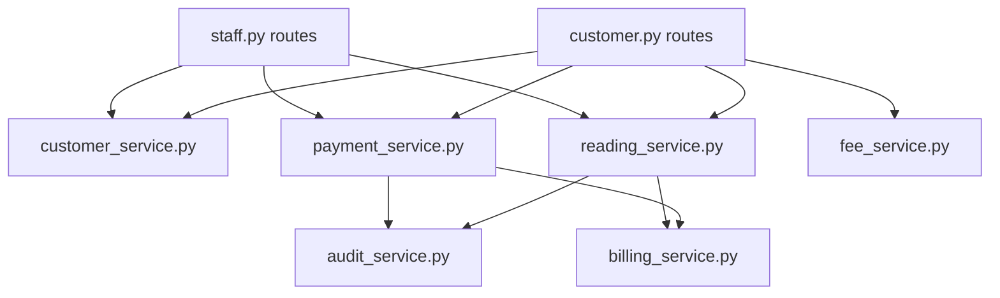

# Services Layer

Business logic is split between API-local services (`api/`) and shared services (`shared/services/`). All are plain Python modules exporting standalone functions.

## API Services

### reading_service.py (`api/reading_service.py`)

Manages reading sync, upload, CRUD, and automatic billing creation.

**`existing_this_month(customer_number, timestamp_dt, exclude_id=None)`** → `MeterReading | None`
Checks if a reading exists for the same customer/year/month.

**`sync_readings(readings, token_id, staff_id, staff_name)`** → `(synced, results, errors)`
Processes a batch from mobile app sync. Each reading validated for customer existence, timestamp format, and monthly duplicate.

| Param | Type | Description |
|-------|------|-------------|
| `readings` | list[dict] | `[{customer_number, reading_value, timestamp?}]` |
| `token_id` | int | API key ID (FK) |
| `staff_id` | int | Staff ID |
| `staff_name` | str | For audit log |

Returns `[{index, reading_id, customer_number, billing?}]` on success.

**`upload_reading(customer_number, reading_value, timestamp, token_id, staff_id, staff_name)`** → `(reading, error, status)`
Single reading upload. Same validation as sync. Auto-creates billing via `_create_billing_for_reading()`.

**`drop_reading(reading_id, staff_id, reason)`** → `MeterReading`
Hard-deletes a reading and its billing record. Validates: must be current month, bill must be unpaid.

**`edit_reading(reading_id, new_value, staff_id)`** → `MeterReading`
Updates reading value and recomputes billing consumption/amount.

### customer_service.py (`api/customer_service.py`)

Customer CRUD and due amount computation.

**`create_customer(data)`** → `(Customer, error)`
Validates customer_number uniqueness, creates record.

**`update_customer(customer, data)`** → `None`
Partial update of customer fields.

**`toggle_active(customer)`** → `None`
Soft-delete (sets `deleted_at`) or restore.

**`list_customers(page, per_page, q, sort_by, sort_dir)`** → `Pagination`
Paginated, searchable, sortable customer listing.

**`compute_customer_due(customer)`** → `float`
Sum of unpaid bills + penalties minus carryover credit.

**`compute_batch_due(customers)`** → `dict[str, float]`
Batch due computation using single query for all customers.

**`get_customer_or_404(customer_id)`** → `Customer`
**`get_customer_by_number(customer_number)`** → `Customer | None`

### fee_service.py (`api/fee_service.py`)

Payment method fee calculations.

**`calculate_fee(amount, method_code)`** → `(fee_percent, fee_amount)`
Looks up active payment method, computes fee using `PaymentMethod.fee_for()`.

**`get_method(code)`** → `PaymentMethod | None`

**`seed_payment_methods()`** → `None`
Seeds 20+ payment methods: GCash, Maya, GrabPay, ShopeePay, cards, direct debit, online banking, OTC (7-Eleven, Cebuana, ECPay, LBC, M Lhuillier, Palawan, Robinsons, SM, USSC), QRPh, BillEase, virtual account.

### billing_service.py (`api/billing_service.py`)

**`ensure_penalty(billing)`** → `float`
Checks if an unpaid bill is past its due date (7 days after reading). If overdue and no penalty yet applied, writes ₱15.00 penalty to DB.

## Shared Services

### payment_service.py (`shared/services/payment_service.py`)

Payment processing with waterfall model.

**`submit_payment(customer_number, amount, cashier_id)`** → `(result, error, status)`
Applies payment to oldest unpaid bills first. Excess cash creates carryover credit on the most recently paid bill. Insufficient payment leaves remainder as unpaid.

**`drop_payment(payment_id, staff_id, reason)`** → `dict`
Undoes a receipt group (all bills sharing the same receipt number). Reverts `is_paid`, clears `paid_amount`, `receipt_number`, `cashier_id`, `payment_timestamp`, `date_paid`, `carryover_offset`.

**`recalc_cumulative_balance(customer_number, *, customer=None)`** → `None`
Recalculates and updates `customer.cumulative_balance` from all `carryover_offset` sums.

**`parse_date_range(period, start_str, end_str, ref_date)`** → `(start, end)`
Converts period type + date strings to datetime bounds. Supports: daily, weekly, monthly, yearly, custom.

**`compute_cashier_tally(start, end, staff_id, group_days)`** → `(tally, use_matrix)`
Aggregates payments within date range, optionally grouped by interval. Returns matrix format when `group_days > 1`.

**`compute_nav_dates(period, start, end, today)`** → `dict`
Returns `prev_date`, `next_date`, `display`, `is_today` for tally navigation.

### audit_service.py (`shared/services/audit_service.py`)

**`log_action(staff_id, action_type, target_type, target_id, details, customer_number=None)`** → `ManagementLog`
Creates an audit log entry. Called automatically by reading_service and payment_service on destructive operations.

### staff_seeder.py (`shared/services/staff_seeder.py`)

**`ensure_prereq_staff()`** → `None`
Seeds superuser (all permissions, password: `superuser`) and xendit system user (`can_accept_payment`, `can_manage_billing`, `can_drop_payment`) on first startup.

**`delete_non_prereq_staff()`** → `None`
Removes all staff except superuser and xendit (used during seed/clear).

## Service Dependency Graph

