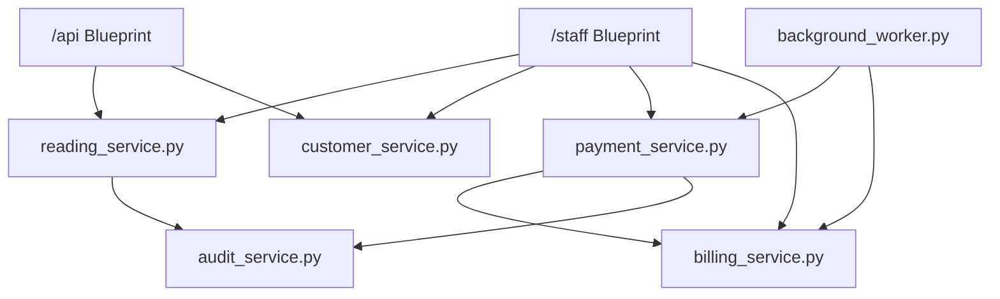

# Services Layer

Business logic lives in `apps/services/` to keep route files thin and avoid duplication between blueprints. Services are plain Python modules exporting standalone functions with no classes or dependency injection.

## Service Dependency Graph

---

## reading_service.py

Functions for reading sync and CRUD operations.

### `sync_readings(readings, token_id, staff_id, staff_name)`

Processes a batch of readings from the mobile app sync. Each reading is checked for monthly duplicates.

| Param | Type | Description |
|---|---|---|
| `readings` | list[dict] | `[{customer_number, reading_value, timestamp}]` |
| `token_id` | int | API key ID (FK for the reading) |
| `staff_id` | int | Staff ID performing the sync |
| `staff_name` | str | Staff name (for audit log) |

**Returns**: `(synced_count, results, errors)` where `results = [{index, reading_id, customer_number}]` and `errors = [{index, error}]`.

### `upload_reading(customer_number, reading_value, timestamp, token_id, staff_id, staff_name)`

Uploads a single reading. Same monthly duplicate check as sync.

| Param | Type | Description |
|---|---|---|
| `customer_number` | str | Customer identifier |
| `reading_value` | float | Meter reading in m³ |
| `timestamp` | float | Unix timestamp |
| `token_id` | int | API key ID |
| `staff_id` | int | Staff ID |
| `staff_name` | str | Staff name (for audit log) |

**Returns**: `(reading, None, 201)` on success, `(None, error_msg, status_code)` on error.

### `drop_reading(reading_id, staff_id, reason)`

Hard-deletes a reading and logs the action.

| Param | Type | Description |
|---|---|---|
| `reading_id` | int | Reading to delete |
| `staff_id` | int | Staff performing the action |
| `reason` | str | Explanation for the deletion |

### `edit_reading(reading_id, new_value, staff_id)`

Updates a reading's value and logs the action.

| Param | Type | Description |
|---|---|---|
| `reading_id` | int | Reading to edit |
| `new_value` | float | New meter reading value |
| `staff_id` | int | Staff performing the edit |

---

## payment_service.py

Functions for payment processing.

### `submit_payment(customer_number, amount, reading_id, cashier_id)`

Processes a payment using a waterfall model: the amount is applied to the customer's oldest unpaid bill first, using cash then available carryover credit. Any excess cash creates a positive carryover_offset on the most recently paid bill (which can be used as credit against the next bill). If payment is insufficient to cover the full billed_amount + penalty, the bill is partially paid with the remainder tracked as unpaid.

| Param | Type | Description |
|---|---|---|
| `customer_number` | str | Customer identifier |
| `amount` | float | Payment amount |
| `reading_id` | int or None | Associated reading ID |
| `cashier_id` | int | Staff ID of the cashier |

### `drop_payment(payment_id, staff_id, reason)`

Deletes a payment record and logs the action.

| Param | Type | Description |
|---|---|---|
| `payment_id` | int | Payment to delete |
| `staff_id` | int | Staff performing the action |
| `reason` | str | Explanation for the deletion |

### `edit_payment(payment_id, new_amount, staff_id)`

Updates a payment's amount, re-computes billing, and logs the action.

### `compute_cashier_tally(start, end, staff_id, group_days)`

Returns aggregated payment data for a given date range, optionally grouped by intervals.

| Param | Type | Description |
|---|---|---|
| `start` | datetime | Start of range |
| `end` | datetime | End of range |
| `staff_id` | int or None | Filter by cashier, or None for all |
| `group_days` | int | Number of days per group interval |

### `compute_nav_dates(period, start, end, today)`

Returns previous/next date boundaries for cashier tally navigation.

| Param | Type | Description |
|---|---|---|
| `period` | str | `"daily"`, `"weekly"`, `"monthly"`, `"yearly"`, or `"custom"` |
| `start` | datetime | Current period start |
| `end` | datetime | Current period end |
| `today` | datetime | Reference date for "is_today" check |

### `parse_date_range(period, start_str, end_str, ref_date)`

Converts date strings to datetime boundaries based on the period type.

| Param | Type | Description |
|---|---|---|
| `period` | str | `"daily"`, `"weekly"`, `"monthly"`, `"yearly"`, `"custom"` |
| `start_str` | str or None | Start date string (`%Y-%m-%d`) |
| `end_str` | str or None | End date string (`%Y-%m-%d`) |
| `ref_date` | datetime or None | Reference date (defaults to UTC now) |

---

## customer_service.py

Functions for customer CRUD and billing computation.

### `create_customer(data, staff_id)`

Creates a new customer record with validation.

### `get_customer_or_404(customer_id)`

Returns a customer by ID or raises 404.

### `update_customer(customer_id, data, staff_id)`

Updates customer fields.

### `toggle_active(customer_id, staff_id)`

Soft-deletes or restores a customer (sets `deleted_at` / `is_active`).

### `list_customers(page, per_page, search, filters)`

Paginated, filtered, searchable customer listing.

### `compute_customer_due(customer)`

Calculates the total due amount for a single customer based on their latest reading, applied pricing tiers, and payment history.

### `compute_batch_due(customers)`

Efficiently computes due amounts for a list of customers (used by manage-customers page).

---

## billing_service.py

### `compute_billed_for_reading(reading_id, customer_number)`

Re-calculates what was billed for a given reading at the time it was processed. Used internally by `payment_service` when creating, dropping, or editing payments to ensure billing amounts are consistent.

---

## audit_service.py

### `log_action(staff_id, action_type, target_type, target_id, details, customer_number=None)`

Creates a `ManagementLog` entry for auditing purposes. Called automatically by `reading_service` and `payment_service` on any destructive or modifying operation.

| Param | Type | Description |
|---|---|---|
| `staff_id` | int | Staff member performing the action |
| `action_type` | str | One of: `duplicate`, `drop`, `edit` |
| `target_type` | str | `"reading"` or `"billing"` |
| `target_id` | int | ID of the affected record |
| `details` | str | Free-text description |
| `customer_number` | str or None | Customer associated with the action |

---

## background_worker.py

Dedicated subprocess that polls the `background_tasks` database table for queued tasks and executes them sequentially. Handles:

- **Xendit Reconciliation**: checks all PENDING `XenditTransaction` records older than 5 minutes against the Xendit API and updates their status. Self-enqueues every 5 minutes (`enqueue_unique`).
- **Backup / Restore**: MySQL dump and restore via `mysqldump` / `mysql`.
- **Seed**: generates test data (customers, readings, bills).
- **Clear**: truncates all tables, preserves system users.
- **Monthly actions**: bulk read, unread, pay, and remove-payment operations.

---

## Penalty Computation

The `ensure_penalty()` mechanism runs before any billing computation: for all customers with unpaid bills older than the configured due period (default 7 days), a fixed late penalty (default ₱15.00) is applied. The penalty value and due_days grace period are configured via the pricing API and `app_config` table.
