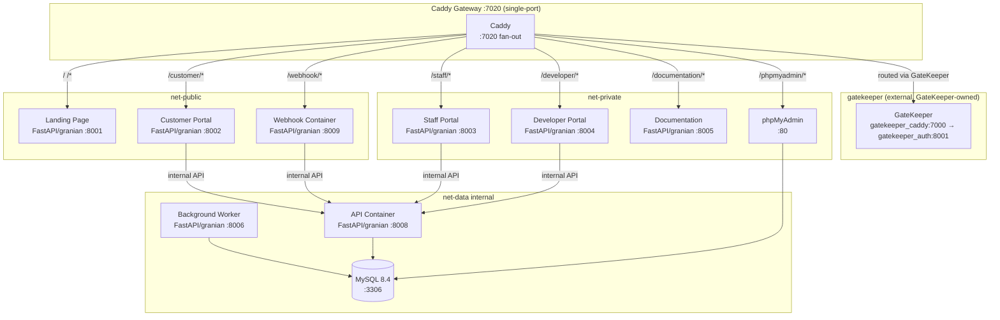
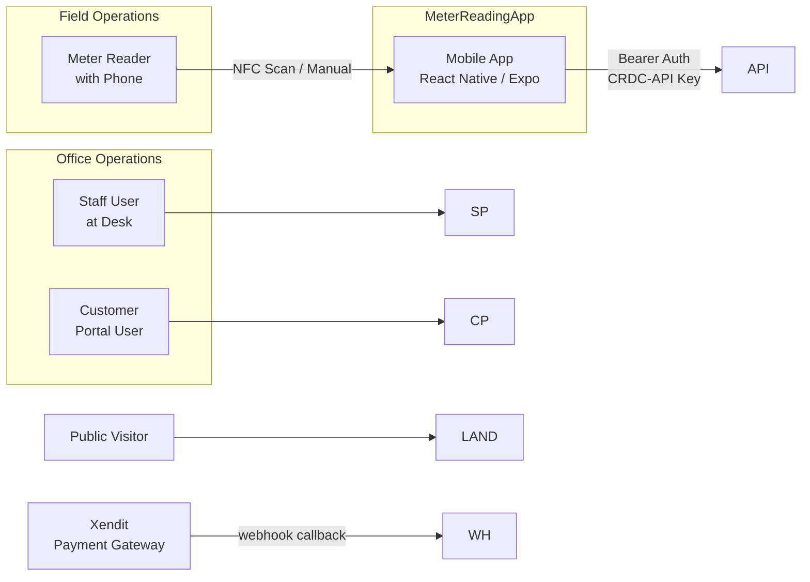

# Cotta Water Billing System

Water billing platform for **Cotta Realty**: meter reading collection, billing computation, payment processing, customer management. 11 Docker services behind a Caddy reverse proxy.

## Services Overview

| Service | Container | Internal Port | Caddy Route | Network |
|---|---|---|---|---|
| **Caddy Gateway** | `waterbillingsystem_gateway` | 7020 | — | net-public, net-private, `gatekeeper` (GateKeeper-owned) |
| **Landing Page** | `waterbillingsystem_landing` | 8001 | `/*` (7020) | net-public |
| **Customer Portal** | `waterbillingsystem_customerportal` | 8002 | `/customer/*` (7020) | net-public, net-api |
| **Staff Portal** | `waterbillingsystem_staffportal` | 8003 | `/staff/*` (7020) | net-private, net-api |
| **Developer Portal** | `waterbillingsystem_devportal` | 8004 | `/developer/*` (7020) | net-private, net-api |
| **Documentation** | `waterbillingsystem_documentation` | 8005 | `/documentation/*` (7020) | net-private |
| **API Container** | `waterbillingsystem_api` | 8008 | — | net-api, net-data |
| **Webhook Container** | `waterbillingsystem_webhook` | 8009 | `/webhook/*` (7020) | net-public, net-api |
| **Background Worker** | `waterbillingsystem_worker` | 8006 (EXPOSE, internal) | — | net-data, net-api |
| **phpMyAdmin** | `waterbillingsystem_phpmyadmin` | 80 | `/phpmyadmin/*` (7020) | net-private, net-data |
| **MySQL 8.4** | `waterbillingsystem_db` | 3306 | — | net-data |

- Live Caddy is single-port **7020** on the GateKeeper-owned `gatekeeper` network (gate `gatekeeper_caddy:7000` → `gatekeeper_auth:8001` verifies via DB routes, then proxies); `caddy-gateway/Caddyfile` live has 0 `GateKeeper gate` — see `compose.yaml` `127.0.0.1:7020:7020` + `Caddyfile`.
- Every Python service — API, all portals, the webhook proxy, the documentation site, and the background worker — is a **FastAPI app run by granian** (ASGI, 1 worker each). The legacy WSGI stack is fully replaced.

## Architecture Diagram

## Relationship Overview

## Quick Links

| Link | Description |
|---|---|
| [Getting Started](getting-started.md) | Prerequisites, setup, and startup instructions |
| [Architecture](architecture.md) | System architecture diagrams, network topology, data flow |
| [BillServer API Reference](bill-server/api-reference.md) | Complete REST API endpoint documentation |
| [Staff Portal](bill-server/staff-portal.md) | Staff portal routes, permissions, and workflows |
| [Database Models](bill-server/models.md) | All 11 SQLAlchemy models |
| [MeterReadingApp Screens](meter-reading-app/screens.md) | All screens, components, and navigation flow |
| [MeterReadingApp Sync](meter-reading-app/sync.md) | Offline sync architecture, polling, and conflict resolution |
| [Docker Setup](docker/index.md) | Docker Compose deployment |
| [API Contract](api-contract/index.md) | Full API contract with auth details |

**Models**: Staff, Customer, MeterReading, Billing, ApiKey, NfcTag, ManagementLog, Config, PaymentMethod, XenditTransaction, BackgroundTask

**Networks**: `net-public` (`internal: true`), `net-private` (`internal: true`), `net-api` (internal), `net-data` (internal), `gatekeeper` (external, GateKeeper-owned)
**Auth**: PyJWT HS256 via `shared/wbs_jwt.py` (ISS `wbs` AUD `waterbillingsystem` — 12h customer / 8h staff+dev); API RBAC via `require_staff(*perms)` OR-semantics with `X-Staff-ID` re-check (no internal-key blanket bypass); see Staff Portal / API Contract.
