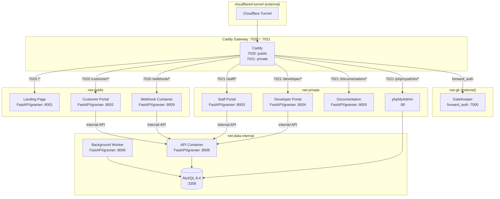
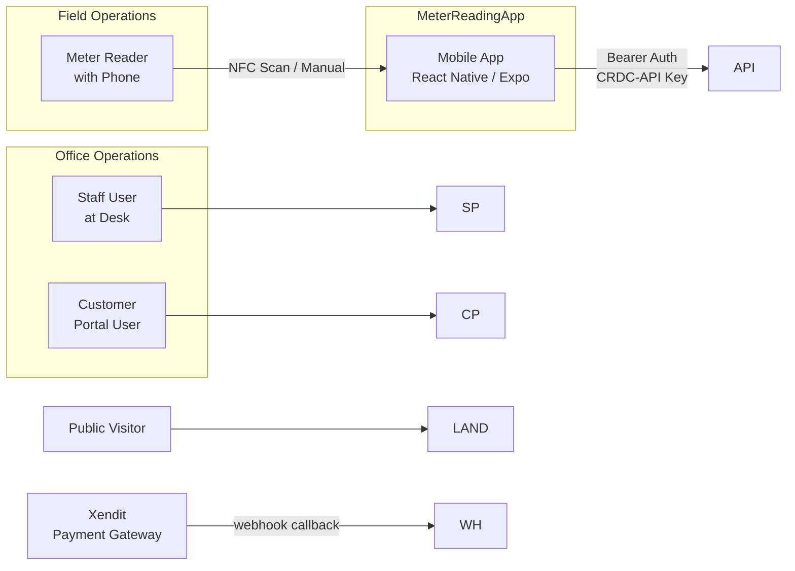

# Cotta Water Billing System

Water billing platform for **Cotta Realty**: meter reading collection, billing computation, payment processing, customer management. 11 Docker services behind a Caddy reverse proxy.

## Services Overview

| Service | Container | Internal Port | Caddy Route | Network |
|---|---|---|---|---|
| **Caddy Gateway** | `caddy-gateway` | 7020 / 7021 | — | public, private, gk, cloudflared |
| **Landing Page** | `landing-page` | 8001 | `/*` (port 7020) | public |
| **Customer Portal** | `customer-portal` | 8002 | `/customer/*` (7020) | public, api |
| **Staff Portal** | `staff-portal` | 8003 | `/staff/*` (7021) | private, api |
| **Developer Portal** | `developer-portal` | 8004 | `/developer/*` (7021) | private, api |
| **Documentation** | `documentation` | 8005 | `/documentation/*` (7021) | private |
| **API Container** | `api` | 8008 | — | api, data, public |
| **Webhook Container** | `webhook-container` | 8009 | `/webhook/*` (7020) | public, api |
| **Background Worker** | `background-worker` | 8006 (EXPOSE, internal) | — | data |
| **phpMyAdmin** | `phpmyadmin` | 80 | `/phpmyadmin/*` (7021) | private, data |
| **MySQL 8.4** | `mysql-db` | 3306 | — | data |

- Port **7020** is public-facing; port **7021** is private.
- All routes go through the Caddy `forward_auth` gate (GateKeeper, external network) except `/webhook/*`, `/health`, and the themed public `/404` page served by the landing page.
- Every Python service — API, all portals, the webhook proxy, the documentation site, and the background worker — is a **FastAPI app run by granian** (ASGI, 1 worker each). The legacy WSGI stack is fully replaced.

## Architecture Diagram

## Relationship Overview

## Quick Links

| Link | Description |
|---|---|
| [Getting Started](getting-started.md) | Prerequisites, setup, and startup instructions |
| [Architecture](architecture.md) | System architecture diagrams, network topology, data flow |
| [BillServer API Reference](bill-server/api-reference.md) | Complete REST API endpoint documentation |
| [Staff Portal](bill-server/staff-portal.md) | Staff portal routes, permissions, and workflows |
| [Database Models](bill-server/models.md) | All 11 SQLAlchemy models |
| [MeterReadingApp Screens](meter-reading-app/screens.md) | All screens, components, and navigation flow |
| [MeterReadingApp Sync](meter-reading-app/sync.md) | Offline sync architecture, polling, and conflict resolution |
| [Docker Setup](docker/index.md) | Docker Compose deployment |
| [API Contract](api-contract/index.md) | Full API contract with auth details |

**Models**: Staff, Customer, MeterReading, Billing, ApiKey, NfcTag, ManagementLog, Config, PaymentMethod, XenditTransaction, BackgroundTask

**Networks**: `net-public` (bridge), `net-private` (bridge), `net-api` (internal), `net-data` (internal), `net-gk` (external `gatekeeper_default`), `cloudflared-tunnel` (external)
