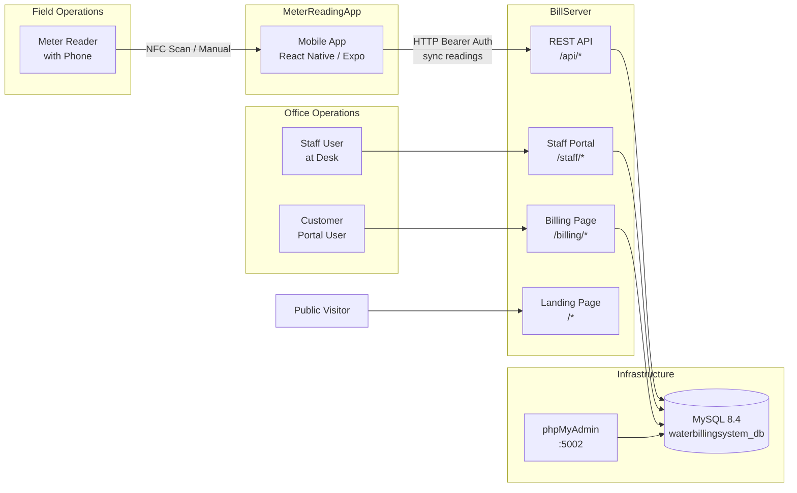

# Cotta Water Billing System

**Cotta Realty**'s water billing platform handles meter reading collection, billing computation, payment processing, and customer management for a residential subdivision.

## Project Components

| Component | Description | Stack | Port |
|---|---|---|---|
| **BillServer** | Flask web application — REST API + staff portal + customer billing portal | Flask 3.1, SQLAlchemy 2.0, MySQL 8.4, Gunicorn | `5005` |
| **MeterReadingApp** | Mobile app for field meter readers — NFC tag scanning, offline SQLite storage, server sync | React Native (Expo), op-sqlite, react-native-nfc-manager | — |
| **Docker** | MySQL 8.4 database + phpMyAdmin admin panel | Docker Compose | `3306`, `5002` |

## Quick Links

| Link | Description |
|---|---|
| [Getting Started](getting-started.md) | Prerequisites, setup, and startup instructions for all components |
| [Architecture](architecture.md) | System architecture diagrams, data flow, and component relationships |
| [BillServer API Reference](bill-server/api-reference.md) | Complete REST API endpoint documentation |
| [BillServer Staff Portal](bill-server/staff-portal.md) | Staff portal routes, permissions, and workflows |
| [BillServer Database Models](bill-server/models.md) | All 9 SQLAlchemy models with columns, types, and relationships |
| [MeterReadingApp Screens](meter-reading-app/screens.md) | All screens, components, and navigation flow |
| [MeterReadingApp Sync](meter-reading-app/sync.md) | Offline sync architecture, polling, and conflict resolution |
| [Docker Setup](docker/index.md) | MySQL and phpMyAdmin deployment |
| [API Contract](api-contract/index.md) | Full API contract with auth details, request/response examples |

**Models**: Staff, Customer, MeterReading, Billing, ApiKey, NfcTag, ManagementLog, Config, XenditTransaction

## Relationship Overview

The mobile app works **offline-first**: readings are stored locally in SQLite and synced to BillServer when connectivity is available. The staff portal provides full CRUD operations on customers, readings, payments, and staff accounts. The billing page lets customers view their bill history using a receipt-based verification flow.
