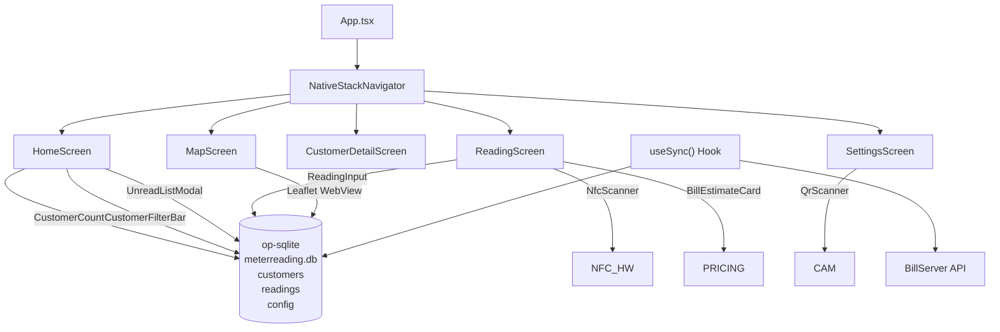

# MeterReadingApp

**Stack**: React Native (Expo) + TypeScript + op-sqlite + react-native-nfc-manager

MeterReadingApp is a mobile application for field meter readers. It enables offline meter reading collection via NFC tag scanning or manual entry, with background sync to BillServer.

## Key Features

| Feature | Description |
|---|---|
| **Offline-First** | Readings stored locally in SQLite, synced when connectivity is available |
| **NFC Scanning** | Scan NFC tags on water meters to automatically identify the customer |
| **Manual Entry** | Type customer number manually as fallback |
| **QR Scanner** | Scan API key QR codes for quick configuration |
| **Bill Estimates** | Real-time bill calculation with tiered pricing breakdown |
| **Map View** | Leaflet map with customer pins for navigation |
| **Filtering** | Filter customers by phase, block, street |
| **Auto-Sync** | Background sync every 10 seconds + on app foreground |
| **Duplicate Protection** | Prevents duplicate monthly readings |

## Architecture

## Tech Stack

| Library | Purpose |
|---|---|
| `react-native` | Cross-platform native UI framework |
| `expo` | Expo SDK for build toolchain and native modules |
| `@react-navigation/native-stack` | Native stack navigation |
| `@op-engineering/op-sqlite` | High-performance JSI-based SQLite engine |
| `react-native-nfc-manager` | NFC tag reading (NDEF text records) |
| `expo-camera` | Camera-based QR code scanning |
| `react-native-webview` | WebView for Leaflet map rendering |
