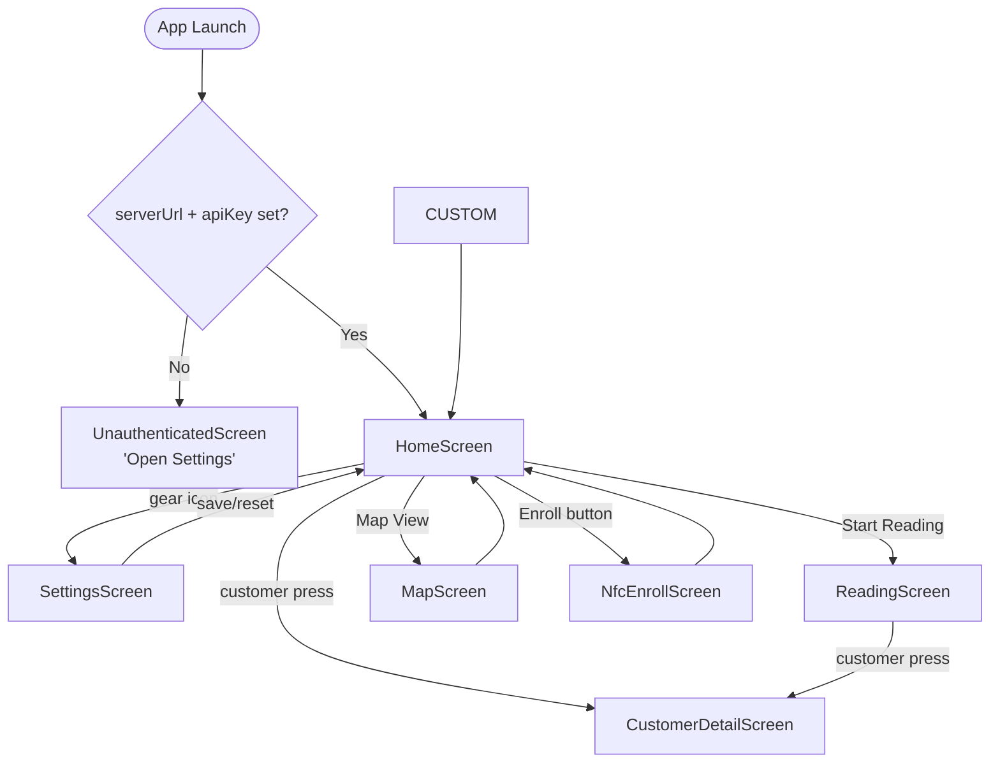

# Screens & Components

## Navigation

`NativeStackNavigator` routes:

```typescript
type RootStackParamList = {
 Unauthenticated: undefined;
 Home: undefined;
 Settings: undefined;
 Reading: undefined;
 CustomerDetail: { customerNumber: string };
 Map: undefined;
 NfcEnroll: undefined;
};
```

Initial route is dynamic:
- `serverUrl` and `apiKey` configured → `'Home'`
- Otherwise → `'Unauthenticated'`

All screens have `headerShown: false` — custom headers throughout.



---

## Screens

### HomeScreen

Main dashboard: customer counts, filters, navigation actions.

**Components used**: `CustomerCountCard`, `CustomerFilterBar`, `UnreadListModal`, `FilterPickerModal`

- Total customer count (filtered or all)
- Unread this month count badge
- Phase / Block / Street filter chips
- "Map View" → `Map`; "Start Reading" → `Reading`; gear icon → `Settings`
- **Hidden "Enroll" button** (green chip) — visible only when API key has `can_enroll_customer`
- Pull-to-refresh refreshes counts and dropdowns

### NfcEnrollScreen

NFC tag enrollment. Only accessible to staff with `can_enroll_customer`.

**Phases**:
1. **`search`** — Type customer number (auto-suggest from local DB, limit 15 results). "Disenroll Tag" button.
2. **`verify`** — Selected customer details (name, number, address, phase/block)
3. **`programming`** — Holds phone near NFC tag, programs the account number
4. **`done`** — Success confirmation, option to enroll another or return home
5. **`error`** — Error display with retry
6. **`disenrolling`** — Erases a programmed tag, restores factory defaults
7. **`disenroll_done`** — Success confirmation after disenrollment

**Programming steps**:
1. Read tag UID
2. Compute password = `computeTagPwd(nfc_pwd_secret, uid)`
3. Detect if tag is reusable (try PWD_AUTH with factory password FFFFFFFF then 00000000)
4. Write customer number ASCII (4-byte padded) to pages 7+
5. Verify customer data by reading back pages
6. Write PWD to page 133, PACK to page 134
7. Verify PWD+PACK together via PWD_AUTH (check PACK = `[00:00]`)
8. Write CFG0 `[04:00:00:04]` to page 131
9. Verify CFG0 by reading back page 131
10. Write CFG1 `[80:00:00:00]` to page 132 (activates read+write protection)
11. Verify CFG1 by reading back page 132
12. Final verification: re-authenticate with new PWD, read back customer data
13. Save to `nfc_cache` + `nfc_enrollments` locally
14. Attempt immediate server sync via `POST /api/nfc/sync` (retries in background if offline)

### ReadingScreen

Core meter reading workflow. Accepts a customer number from NFC scan or manual entry.

**Components used**: `NfcScanner`, `CustomerInfoCard`, `ReadingHistoryPill`, `ReadingInput`, `BillEstimateCard`, `SubmitSummary`

Workflow states:
1. **`waiting`** — Waiting for NFC tag or manual number entry
2. **`found`** — Customer found: info card, reading history, input
3. **`summary`** — Confirmation with `SubmitSummary` (checkmark, value, consumption, bill estimate, "Print Receipt" button, "Back to Scan")
4. **`error`** — Error message with retry

- NFC listener active in `waiting` state — uses **PWD_AUTH** to authenticate and read protected tags
- Reading exists for this customer in current month → input disabled, "Already Read — Submit Blocked"
- Bill estimate recalculates as the user types
- After submit: confirmation + "Back to Scan"

### CustomerDetailScreen

Full customer information with readings and map coordinates.

**Route params**: `{ customerNumber: string }`

- Name, number, address
- Phase / Block / Street
- Contact info
- Recent readings (up to 6, value and date)
- FlatList of all customers with coordinates (selected highlighted)

### MapScreen

Leaflet.js map in a WebView. Customer markers with popups.

**Components used**: None standalone (renders HTML via WebView)

- Customer pins at (x_coordinate, y_coordinate)
- Popups: name, customer number, address, last reading
- Powered by Leaflet 1.9.4 with OpenStreetMap tiles

### SettingsScreen

App configuration.

**Components used**: `QrScanner`

| Setting | Description |
|---|---|
| **Server IP** | BillServer IP address |
| **Server Port** | BillServer port (default 5005) |
| **API Token** | API key (manual entry or QR scan) |
| **History Per Customer** | TextInput (1–24), default 5 |
| **Clear Unsynced** | Drop readings not yet synced to server |
| **Reset All Data** | Clears DB and returns to Home (re-auth required) |

---

## Components

### NfcScanner
Invisible component running a continuous scan loop using `NfcTech.NfcA`. On tag discovery:
1. Reads UID hex from pages 0-1 (always public)
2. Checks if tag is MifareUltralight via `isMifareUltralight()`
3. Looks up UID in local `nfc_cache` table
4. Computes password via `computeTagPwd(nfcPwdSecret, uid)`
5. Sends **PWD_AUTH**: computed password → cached password (if different) → factory FFFFFFFF → factory 00000000
6. Reads memory pages 7–18 via `NfcManager.transceive()`, parses raw ASCII for customer number
7. Verifies customer number matches `nfc_cache` entry (tampering detection)
8. Calls `onTag(customerNumber)` or `onError(message)`

### QrScanner
Camera view (`expo-camera` `CameraView`) scanning QR codes containing API keys. Requests camera permission on first use.

### CustomerInfoCard
Customer name, number, address in a styled card.

### ReadingHistoryPill
"Last Reading" card (value, date, reader) + "View History" pill. Opens a modal with a scrollable list of readings (value, date, reader, pending badge for unsynced).

### ReadingInput
Numeric `TextInput` with decimal keypad. Accepts meter readings in cubic meters (m³).

### BillEstimateCard
Toggle-able card showing the estimated bill for the entered reading, broken down by pricing tier with subtotals and total.

### SubmitSummary
Post-submit confirmation card: checkmark, customer name, reading value, consumption since last reading, estimated bill amount, "Print Receipt" (disabled), "Back to Scan".

### CustomerCountCard
Large centered count display with "Unread This Month" button.

### CustomerFilterBar
Three filter chips (Phase / Block / Street) + "Clear". Each chip opens a bottom-sheet picker.

### FilterPickerModal
Bottom-sheet modal with a FlatList of filter options, populated from distinct values in the local customer database.

### UnreadListModal
Bottom-sheet modal listing customers with no reading in the current month. Row press → `CustomerDetailScreen`.

### ErrorBoundary
React class-based error boundary. Displays "Something went wrong" with error details and a "Restart" button.
