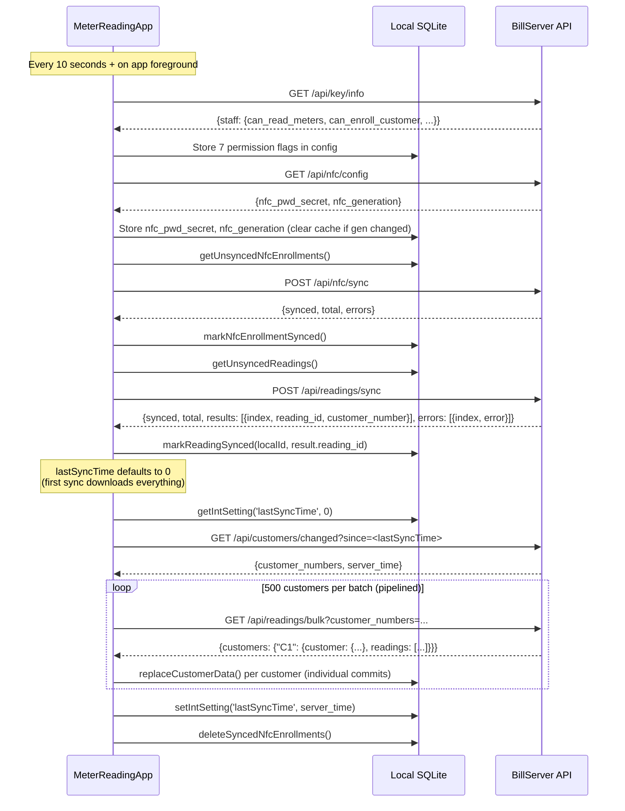
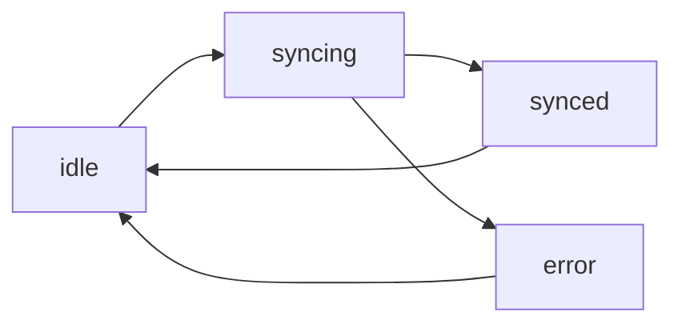

# Sync Architecture

The MeterReadingApp uses an **offline-first** sync architecture. Data is collected locally in SQLite and synchronized with BillServer in the background.

## Overview



## Sync Engine: `useSync()`

The sync engine is implemented as a custom React hook in `src/services/syncService.ts`.

### State Machine



### API

```typescript
const {
  syncStatus,       // 'idle' | 'syncing' | 'synced' | 'error'
  triggerSync,      // () => void — manual sync trigger
  lastError,        // string | null
  lastSyncCount,    // number
  resetSyncState,   // () => void
  pendingCount,     // number — unsynced readings
  serverTotal,      // number — total customers on server
  lastSyncTime,     // string | null
  localCount,       // number — customers in local DB
  resyncNfc,        // () => Promise<void> — force re-download NFC cache
  resyncReadings,   // () => Promise<void> — clear local data and re-download all
  resyncing,        // boolean — true during resync operation
} = useSync();
```

### Sync Triggers

| Trigger | Behavior |
|---|---|
| **On mount** | Runs `doSync()` immediately |
| **Polling** | Runs every 10 seconds (setInterval) |
| **AppState change** | Runs when app returns to `'active'` |
| **Manual** | Via `triggerSync()` (passed to ReadingScreen for post-submit sync) |

### Sync Flow (detailed)

1. **Fetch permissions** — GET `GET /api/key/info`. Validates API key, caches staff permissions (`can_enroll_customer`, `can_read_meters`, etc.) in local config.

2. **Fetch NFC config** — GET `GET /api/nfc/config`. Retrieves `nfc_pwd_secret` (for offline password computation) and `nfc_generation` (cache invalidation counter). Clears local NFC cache if generation has changed.

3. **Upload NFC enrollments** — Fetch unsynced NFC enrollments from local `nfc_enrollments` table. POST to `POST /api/nfc/sync`. On success, mark enrollments as synced.

4. **Upload readings** — Fetch all unsynced readings from local DB (`synced=0 AND rejected=0`). POST to `POST /api/readings/sync`. On success, mark readings as synced (with server ID) or rejected (if duplicate).

5. **Check for changes** — GET `GET /api/customers/changed?since=<lastSyncTime>`. Returns list of changed customer numbers and the server's current timestamp.

6. **Download** — Pipeline fetch batches of up to 500 customer numbers using `GET /api/readings/bulk`. For each batch:
   - Fetch next batch in background while processing current one (pipelining)
   - Process NFC cache: upsert `nfc_cache` entries from `nfc_uid` fields (compute PWD via `computeTagPwd(nfc_pwd_secret, uid)`)
   - Call `replaceCustomerData()` per customer with individual commits
   - Drop old readings for this customer and insert fresh data

7. **Update timestamp** — Save `server_time` as `lastSyncTime` for next sync.

8. **Cleanup** — Delete synced NFC enrollment records from `nfc_enrollments`.

### Concurrency

- Uses `syncingRef` to prevent concurrent syncs
- Uses `AbortController` to cancel the previous sync when a new one is triggered
- All DB operations are serialized through `withDb()` (sequential promise queue)

### First Sync Behavior

`lastSyncTime` defaults to `0` (Unix epoch). This means the first sync triggers a full download of all active customers and their reading history.

## Database Schema

### Tables

```sql
config (key TEXT PRIMARY KEY, value TEXT)
customers (customer_number TEXT PRIMARY KEY, ...)
readings (id INTEGER PRIMARY KEY AUTOINCREMENT, server_id INTEGER UNIQUE,
          customer_number TEXT, reading_value REAL, timestamp INTEGER,
          synced INTEGER DEFAULT 0, rejected INTEGER DEFAULT 0)
nfc_cache (uid TEXT PRIMARY KEY, customer_number TEXT, password TEXT)
nfc_enrollments (id INTEGER PRIMARY KEY AUTOINCREMENT, uid TEXT,
                 customer_number TEXT, synced INTEGER DEFAULT 0)
```

### Key Config Values

| Key | Type | Description |
|---|---|---|
| `serverUrl` | string | BillServer base URL |
| `apiKey` | string | API token |
| `historyCount` | int | Readings per customer (UI default 5, sync defaults to 5 if unset) |
| `lastSyncTime` | int | Server timestamp for incremental sync (default 0 = full download) |
| `nfc_pwd_secret` | string | Secret for deriving NFC tag passwords |
| `nfc_generation` | int | Generation counter for NFC secret rotation |
| `nfc_has_pending` | string | `'1'` if local NFC enrollments need upload |
| `server_time` | string | Server timestamp used for month boundary calculations |
| `pricing_tiers` | string | JSON array of pricing tiers (24h cache) |
| `pricing_fetched_at` | string | Timestamp when pricing was last fetched |
| `canEnrollCustomer` | string | Cached `can_enroll_customer` permission |
| `canReadMeters` | string | Cached `can_read_meters` permission |
| `perm_fetched` | string | `'1'` after first permission fetch |
| `lastServerWrite` | int | Timestamp of last server write operation |

## Duplicate Month Protection

Before saving a reading (either locally or syncing to server), the app checks for an existing reading by the same customer in the current calendar month. The server also enforces this check independently, ensuring consistency even if the local check is bypassed.

## Request Flow

```mermaid
graph TD
    A[User enters reading] --> B{saveReading() in DB}
    B --> C[Local SQLite]
    B --> D{synced=0}
    D --> E[Next sync cycle picks it up]
    E --> F[POST /api/readings/sync]
    F --> G{Server validates}
    G -->|"OK"| H[markReadingSynced]
    G -->|"Duplicate"| I[markReadingRejected]
```

## Type Conversions

The sync service handles the mismatch between API types (`customer_number` as `number`) and SQLite storage (`customer_number` as `string`):

| Direction | Conversion |
|---|---|
| Uploading readings | `Number(r.customer_number)` → number |
| Uploading NFC enrollments | `Number(e.customer_number)` → number |
| Storing downloaded customers | `String(data.customer.customer_number)` → string |
| Storing NFC cache | `String(tag.customer_number)` → string |
| Inline NFC enrollment sync | `Number(accountNumber)` → number |
