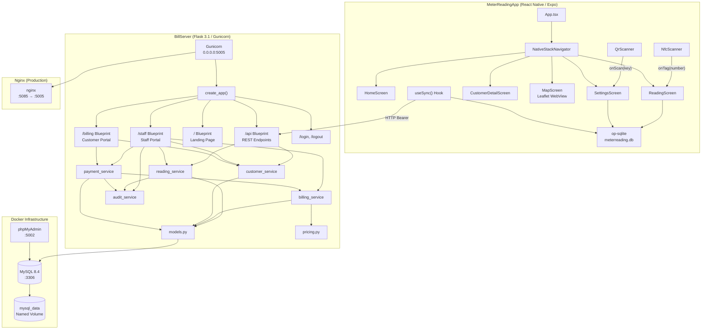
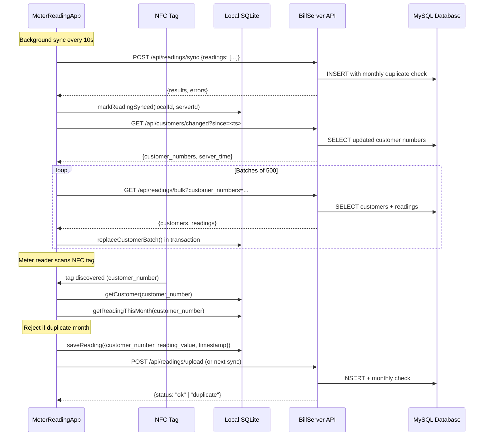
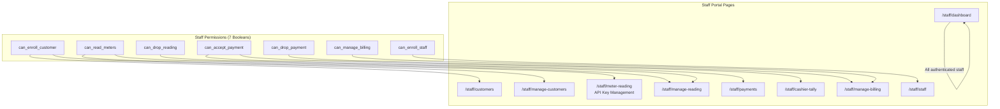
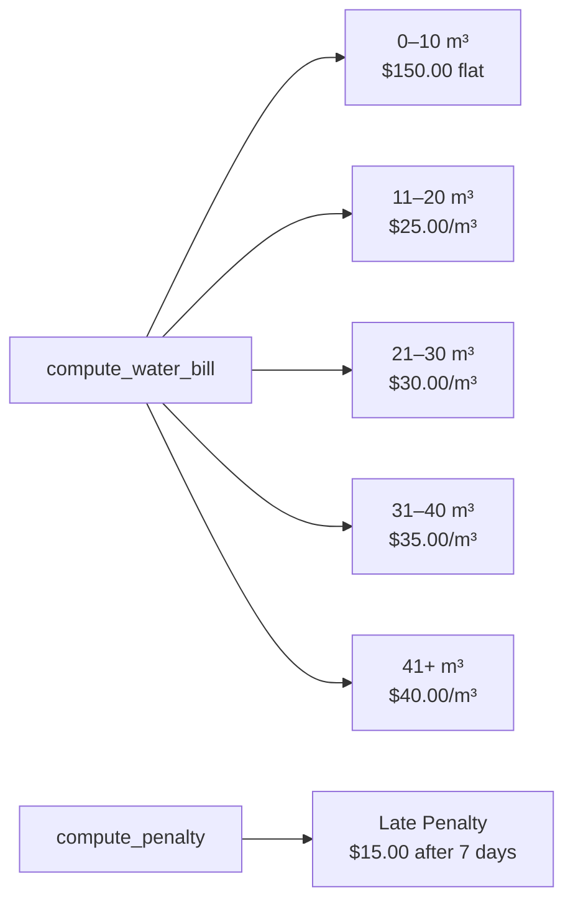

# System Architecture

## High-Level Container Diagram

---

## Data Flow: Reading Sync

---

## Staff Portal Permission Matrix

---

## API Authentication Methods

| Method | Header / Parameter | Used By |
|---|---|---|
| **Bearer Token** | `Authorization: Bearer CRDC-<32hex>` | MeterReadingApp sync, mobile API calls |
| **Query Parameter** | `?api_key=CRDC-<32hex>` | Alternative to Bearer token |
| **Flask-Login Session** | Cookie-based | Staff portal, `/api/customer/:num` |
| **Billing Cookie** | Signed cookie (receipt + name) | Customer billing portal `/billing/*` |

---

## Pricing Engine

Progressive tier calculation: consumption is applied to each tier bracket sequentially. For example, 35 m³ = $150 (first 10) + $250 (next 10 at $25) + $300 (next 10 at $30) + $175 (last 5 at $35) = **$875 total**.
