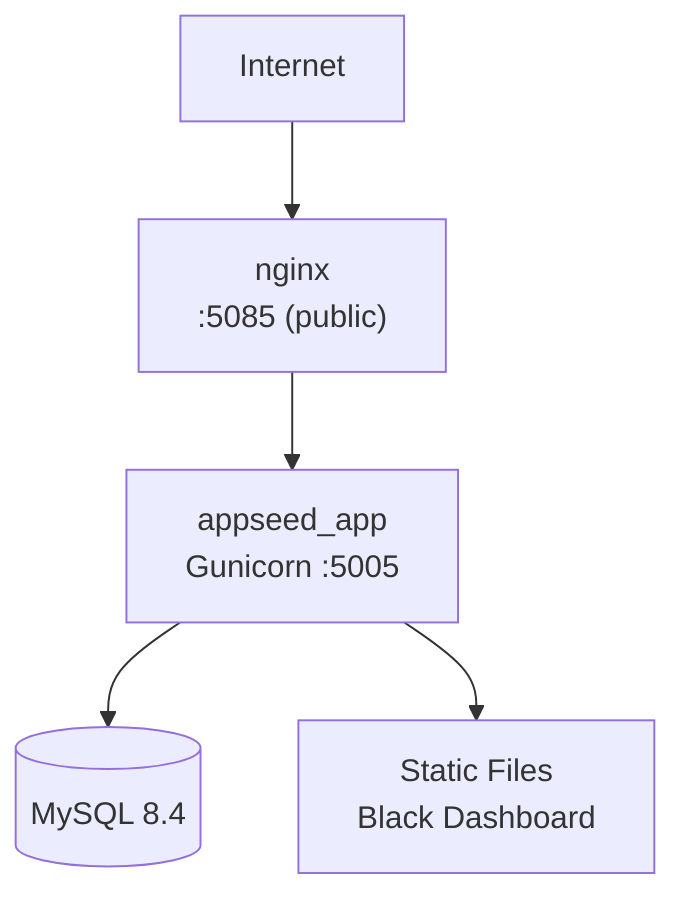

# Deployment

BillServer can be deployed in two configurations.

## Development (Direct)

```bash
cd BillServer
source .venv/bin/activate
python run.py
```

This uses Flask's built-in development server on port `5005`.

## Production (Docker + Nginx)

### Infrastructure



### docker-compose.yml

```yaml
services:
  appseed-app:
    build: .
    container_name: appseed_app
    restart: always
    expose:
      - "5005"
    networks:
      - db_network
      - web_network

  nginx:
    image: nginx:latest
    container_name: nginx_appseed
    restart: always
    ports:
      - "5085:5085"
    volumes:
      - ./nginx/appseed-app.conf:/etc/nginx/conf.d/default.conf
    networks:
      - web_network

networks:
  db_network:
    external: true
  web_network:
    external: true
```

### Nginx Config (nginx/appseed-app.conf)

```nginx
upstream webapp {
    server appseed_app:5005;
}

server {
    listen 5085;
    gzip on;

    location / {
        proxy_pass http://webapp;
        proxy_set_header Host $host;
        proxy_set_header X-Real-IP $remote_addr;
        proxy_set_header X-Forwarded-For $proxy_add_x_forwarded_for;
    }
}
```

### Important Notes

- **MySQL is NOT included** in the BillServer docker-compose. It connects to an external MySQL instance (the one from `Docker/MySQL-compose.yml` or a cloud-hosted database).
- The Dockerfile runs `flask db upgrade` before starting Gunicorn.
- The `db_network` and `web_network` Docker networks must be created beforehand:

```bash
docker network create db_network
docker network create web_network
```

## Environment Configuration

In production, set `DEBUG=False` in `.env` (or environment variable) to use `ProductionConfig`. The production config disables Flask debug mode and uses a more restrictive setup.

## Health Check

```bash
curl http://localhost:5005/api/health
```
```json
{"status": "ok", "db": true}
```
