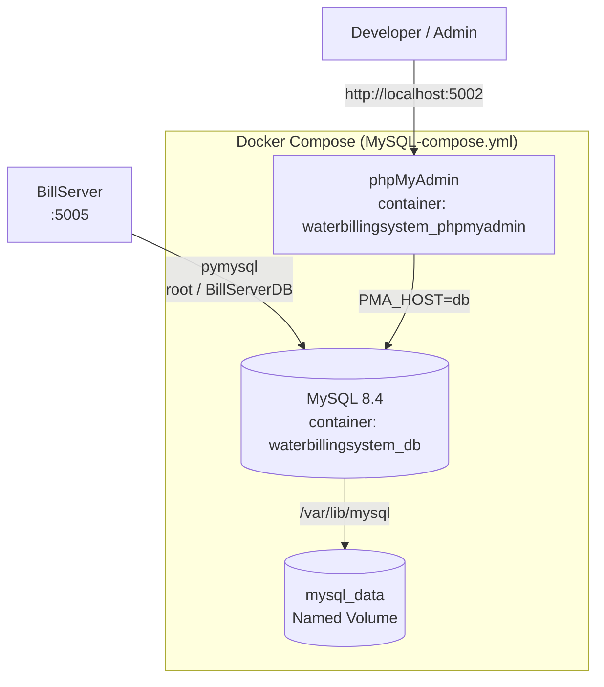

# Docker Infrastructure

## Overview

The Docker project provides the **MySQL 8.4 database** that BillServer depends on. It is a standalone service — BillServer connects to it via the host network.



## Services

### MySQL 8.4

| Property | Value |
|---|---|
| Image | `mysql:8.4` |
| Container name | `waterbillingsystem_db` |
| Host port | `3306` |
| Container port | `3306` |
| Root password | `BillServerDB` |
| Auto-created database | `BillServerDB` |
| Data persistence | Named volume `mysql_data` → `/var/lib/mysql` |

### phpMyAdmin

| Property | Value |
|---|---|
| Image | `phpmyadmin:latest` |
| Container name | `waterbillingsystem_phpmyadmin` |
| Host port | `5002` |
| Container port | `80` |
| Connection target | `PMA_HOST=db` (Docker DNS) |

Access at: **`http://localhost:5002`** (login with root / BillServerDB)

## docker-compose.yml

```yaml
services:
  db:
    image: mysql:8.4
    container_name: waterbillingsystem_db
    restart: always
    environment:
      MYSQL_ROOT_PASSWORD: BillServerDB
      MYSQL_DATABASE: BillServerDB
    ports:
      - 3306:3306
    volumes:
      - mysql_data:/var/lib/mysql
  phpmyadmin:
    image: phpmyadmin:latest
    container_name: waterbillingsystem_phpmyadmin
    restart: always
    ports:
      - 5002:80
    environment:
      PMA_HOST: db
volumes:
  mysql_data:
```

## Usage

### Start

```bash
cd Docker
docker compose -f MySQL-compose.yml up -d
```

### Stop

```bash
docker compose -f MySQL-compose.yml down
```

### Stop + Remove Data

```bash
docker compose -f MySQL-compose.yml down -v
```

### View Logs

```bash
docker compose -f MySQL-compose.yml logs -f
```

## Connecting

### From BillServer (host network)

Configured in `.env`:

```
DB_ENGINE=mysql+pymysql
DB_NAME=BillServerDB
DB_HOST=localhost
DB_PORT=3306
DB_USERNAME=root
DB_PASS=BillServerDB
```

### From another Docker container

```bash
docker network connect db_network <my-container>
```

Then connect to host `db` port `3306`.

### From phpMyAdmin

Open `http://localhost:5002` and log in with:
- **Server**: `db` (pre-filled)
- **Username**: `root`
- **Password**: `BillServerDB`

## Notes

- There are **no custom Dockerfiles, init scripts, or MySQL config files**. This is a minimal, vanilla MySQL 8.4 deployment.
- The MySQL container does **not** run as part of BillServer's docker-compose. BillServer expects an external MySQL instance.
- Persistent data is stored in the Docker named volume `mysql_data`. It survives container restarts and recreations.
