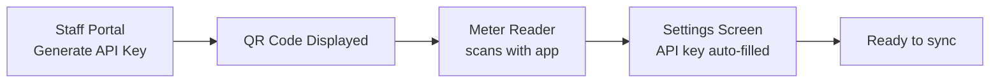

# NFC & QR Scanning

## NFC Tag Scanning

NFC tags (NTAG215 clones) are attached to each water meter. Tags are **password-protected** using NTAG215's PWD_AUTH feature. The app scans these tags to automatically identify the customer without manual entry.

### Security Model

NTAG215 tags have a **factory-burned read-only UID** (unclonable) and support **PWD_AUTH** — a 4-byte password that protects all user memory. The password is derived locally from `NFC_PWD_SECRET` + tag UID.

| Threat | Mitigation |
|--------|-----------|
| Read tag with NFC phone | PWD_AUTH blocks all READ/WRITE commands |
| Copy UID to another tag | UID is factory-burned, unchangeable |
| Clone account number | Memory is password-protected, can't read without auth |
| Brute-force password | Each attempt requires physical NFC tap (~4cm range) |

### How Reading Works

```
1. Tap phone to tag
2. Read UID from pages 0-1 (public, no auth)
3. Lookup in local nfc_cache by UID
4. Compute PWD = SHA-256(nfc_pwd_secret + uid)[:4] → hex
5. PWD_AUTH with computed PWD (fallback: cached, factory FFFF, factory 0000)
6. Read customer number from pages 7+ (protected area, readable after auth)
7. Verify customer number matches nfc_cache entry (tamper detection)
8. Return customer to caller
```

### Tag Format (Protected Memory)

On this clone, config registers are at different addresses than genuine NXP NTAG215:

| Page | Content | Access |
|------|---------|--------|
| 0x00-0x01 | UID (7 bytes) | Always readable (factory) |
| 0x02-0x03 | Lock bytes, OTP | Always readable |
| 0x04 | RESERVED (MIRROR auto-copies UID) | Protected |
| 0x05-0x06 | Unused | Protected |
| 0x07+ | Customer number (ASCII, 4-byte padded) | Protected |
| 0x83 | CFG0 = [04:00:00:04] (AUTH0=4) | Config |
| 0x84 | CFG1 = [80:00:00:00] (PROT=1) | Config |
| 0x85 | PWD (4 bytes) | Config |
| 0x86 | PACK = [00:00:00:00] | Config |

### Enrollment Flow

Only staff with `can_enroll_customer` permission see the "Enroll" button. Every write is verified by reading back or functional test.

```
1. Verify NTAG215 (GET_VERSION)
2. Read UID from pages 0-1
3. Compute PWD = SHA-256(nfc_pwd_secret + uid)[:4] → hex
4. Check if UID already in nfc_cache → abort if registered
5. Authenticate with factory PWD (FFFF then 0000)
6. Write customer number ASCII to pages 7+ (4-byte alignment)
7. Verify customer data by reading back and comparing
8. Write PWD to page 133, PACK to page 134
9. Single PWD_AUTH to verify both PWD works AND PACK matches [00:00]
10. Write CFG0 [04:00:00:04] to page 131 (AUTH0=4)
11. Verify CFG0 by reading back
12. Write CFG1 [80:00:00:00] to page 132 (PROT=1, activates read+write)
13. Verify CFG1 by reading back
14. Final auth + read customer data to confirm lock works
15. Save to local DB + sync to server
```

### Implementation Details

**Files**: `src/components/NfcScanner.tsx`, `src/services/nfcService.ts`, `src/screens/NfcEnrollScreen.tsx`

#### NfcScanner (Reading Mode)

1. Tag discovered via `registerTagEvent` + `requestTechnology(NfcTech.NfcA)`
2. Reads UID from pages 0-1, extracts 7 bytes (skip BCC0)
3. Looks up UID in local `nfc_cache` table
4. Computes PWD via `computeTagPwd(nfcPwdSecret, uid)`
5. Sends PWD_AUTH with computed PWD, falls back to cached/factory
6. Reads customer number from pages 7+ (protected area)
7. Verifies against cache (tamper detection)
8. Returns customer number

#### NFC Password Derivation

```typescript
// SHA-256-based derivation, 4-byte output as 8-char hex
function nfcPasswordHash(key: string, identifier: string): string {
  const hash = sha256(key + identifier);
  return bytesToHex(hash.slice(0, 4));
}

function computeTagPwd(nfcPwdSecret: string, uid: string): string {
  return nfcPasswordHash(nfcPwdSecret, uid);
}
```

NTAG215 PWD_AUTH command: `0x1B + 4-byte-password` → sends via `NfcManager.transceive()`

### Behavior

- **NFC listener** is registered when entering program/disenroll mode
- **Concurrent scan prevention**: `processingRef` flag prevents duplicate processing
- **Haptic feedback**: Vibrate 100ms on success, 200ms on error
- **UID verification**: After PWD_AUTH, reads customer number from tag and verifies 1:1 match with `nfc_cache`
- **Error handling**: Shows error message overlay, ready for next scan
- **Cleanup**: Unsubscribes from NFC events on component unmount

### Permissions

Configured in `app.json`:

```json
{
  "expo": {
    "plugins": ["react-native-nfc-manager"],
    "android": {
      "permissions": ["android.permission.NFC"]
    }
  }
}
```

### Offline Support

- `NFC_PWD_SECRET` downloaded once during sync, stored in config
- All NFC password computation is local (SHA-256 in pure TypeScript)
- `nfc_cache` table pre-populated during customer data sync
- Enrollments stored in `nfc_enrollments` (synced=0), uploaded on next sync cycle
- Full reading flow works offline

---

## QR Code Scanning

QR codes are used to configure the API key. This is faster and less error-prone than manual entry.

### How It Works

1. Staff generates an API key from the web portal (`/staff/meter-reading`)
2. Staff member displays the QR code (or prints it) — the QR code contains the API key string
3. Meter reader opens **Settings** → taps QR icon
4. Camera opens, scans the QR code
5. API key field is automatically populated

### Implementation Details

**File**: `src/components/QrScanner.tsx`

Uses `expo-camera`'s `CameraView` with barcode scanning mode. Requests camera permission at runtime. Extracts the text content of the QR code and calls `onScan(text)`.

### Usage Flow


